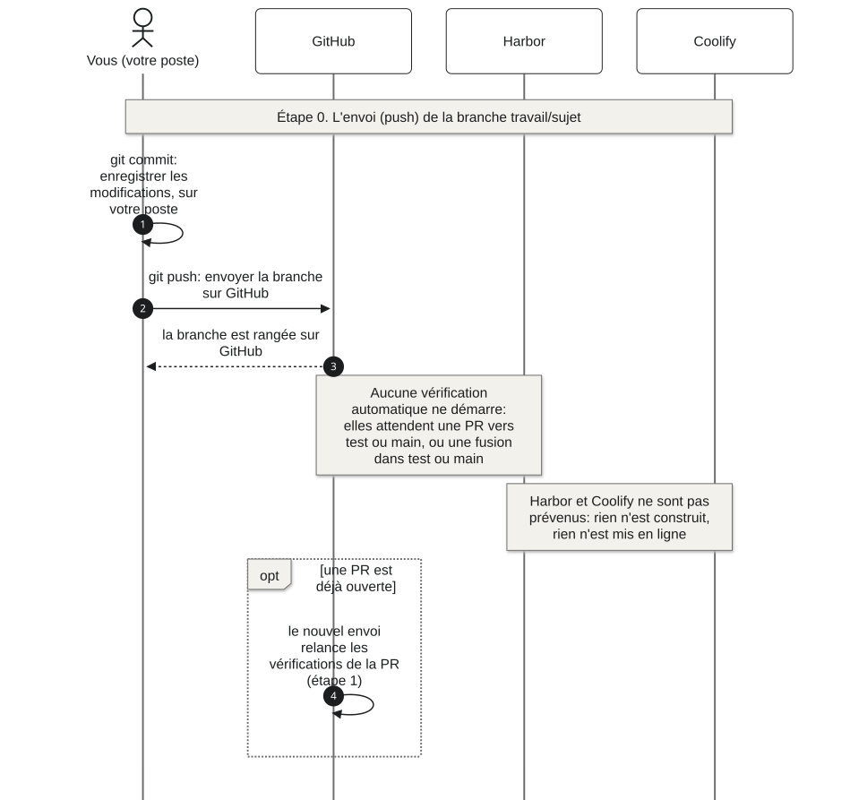
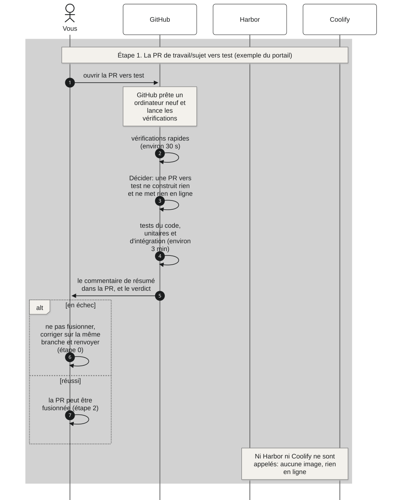
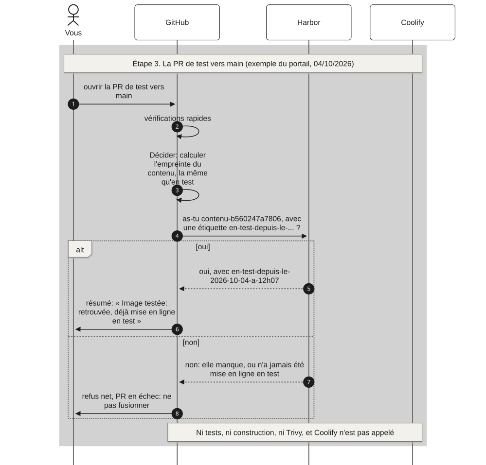
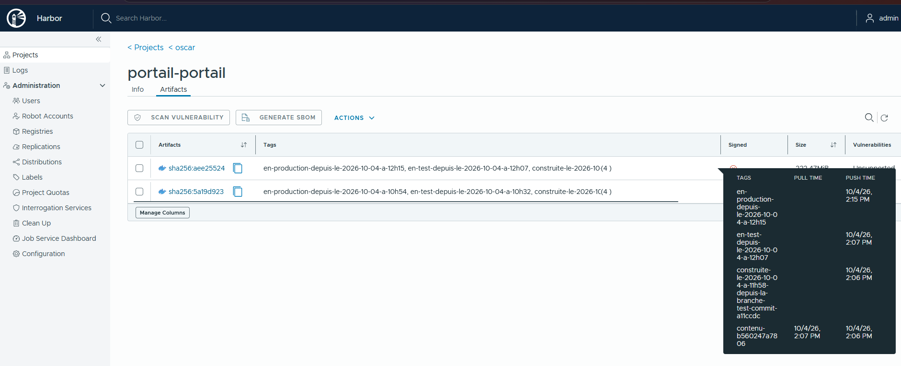
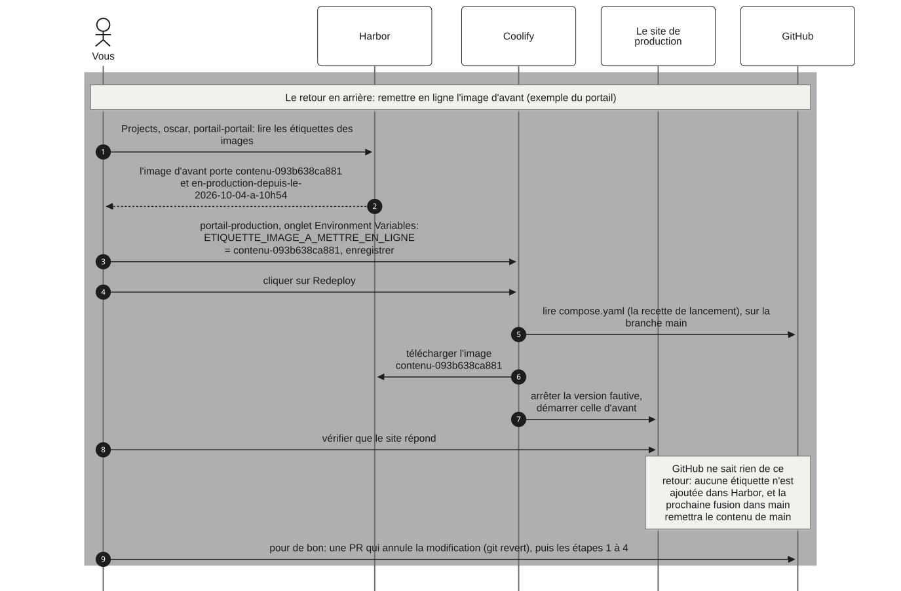

# Comment une modification arrive en production

Ce qui se passe, exactement, entre le moment où vous envoyez une modification
sur GitHub et le moment où elle tourne en production; puis comment revenir en
arrière. Chaque étape a son schéma, qui montre qui parle à qui, dans l'ordre.

Les exemples sont réels: le portail, le 4 octobre 2026 (PR 36, puis PR 37). Les
deux autres applications (l'outil DNS, le laboratoire) suivent exactement le
même parcours, avec leurs propres noms. Toutes les heures sont en UTC.

Dans le portail, **un clic sur un schéma l'ouvre en grand**: c'est utile pour
les plus longs, que la colonne de texte réduit.

Les commandes à taper, étape par étape, sont dans [le cycle pas à
pas](02-le-cycle-pas-a-pas.md). Cette page-ci explique ce qui se passe derrière.

## En bref



- **Étape 0, l'envoi** (`push`: envoyer ses modifications sur GitHub), sur une branche
  de travail: rien ne démarre, rien n'est mis en ligne.
- **Étape 1, la PR vers `test`** (une demande de fusion): GitHub vérifie et teste;
  rien n'est construit, rien n'est mis en ligne.
- **Étape 2, la fusion dans `test`** (on accepte la PR): GitHub construit l'image **une
  seule fois**, la range dans Harbor, et demande à Coolify de la mettre en
  ligne en test.
- **Étape 3, la PR de `test` vers `main`**: GitHub vérifie en quelques secondes que
  l'image testée existe; rien n'est refait.
- **Étape 4, la fusion dans `main`**: **la même image** est mise en ligne en production,
  sans rien reconstruire ni retester.

**Et si la production casse**: le retour en arrière remet en ligne, à la main,
l'image d'avant, depuis Harbor et Coolify, en quelques dizaines de secondes
(23 s mesurées sur le laboratoire, en test).

**La légende des couleurs**, la même sur tous les schémas de cette page:

| Couleur | Moment |
|---|---|
| blanc, bord en pointillé | l'envoi |
| gris moyen | une PR (vers `test` ou vers `main`): on vérifie, rien n'est mis en ligne |
| papier (beige clair) | la fusion dans `test`: la mise en ligne en test |
| **orange** | la fusion dans `main`: **la production**, le moment le plus important |
| gris foncé | le retour en arrière |

Source du schéma: [`schemas/07-parcours-en-bref.mmd`](schemas/07-parcours-en-bref.mmd).

## Les acteurs

| Acteur | Ce qu'il est, en une phrase |
|---|---|
| **Vous** | la personne qui modifie un fichier d'une application: du code, un réglage, une page |
| **GitHub** | le site qui garde le code (les dépôts) et qui lance les **vérifications automatiques** (des contrôles et des tests faits sans personne, sur un ordinateur que GitHub prête le temps d'une exécution); c'est lui qui dirige tout |
| **Harbor** | l'entrepôt des images, à l'adresse `registry-container.oscar-bot.com`, projet `oscar`; il range les images et répond quand on l'interroge, mais il ne prévient personne |
| **Coolify** | la plateforme qui fait tourner les applications sur notre serveur, à l'adresse `deploy.oscar-bot.com`; il ne fait que ce qu'on lui demande: les ordres de GitHub, ou les vôtres pour un retour en arrière |
| **Le site en ligne** | l'application que voient les visiteurs: pour le portail, `https://test-tech.oscar-bot.com` en test et `https://tech.oscar-bot.com` en production; Traefik (le proxy: le programme qui reçoit les visiteurs et les envoie vers la bonne application) les y conduit |

**Qui prévient qui?** C'est GitHub qui dirige tout. Harbor ne prévient
personne. Coolify n'écoute ni Harbor ni GitHub de lui-même (son déclenchement
automatique est coupé): il obéit seulement aux ordres que GitHub lui envoie par
son API (sa porte d'entrée pour les programmes).

Deux mots reviennent partout:

- **Une image** (le paquet prêt à lancer d'une application: son code, tout ce
  dont il a besoin, et la commande qui la démarre). Le portail n'a qu'une
  image construite par nous, rangée dans Harbor sous le nom
  `oscar/portail-portail`; sa base de données tourne sur l'image publique de
  PostgreSQL.
- **Une étiquette** (un nom collé sur une image, comme un post-it sur une
  boîte). Une image porte plusieurs étiquettes; elles sont expliquées plus bas,
  dans [les étiquettes](#les-etiquettes).

## Étape 0. L'envoi (push) d'une branche de travail



Vous travaillez sur une branche (une ligne de travail à part) nommée
`travail/<sujet>`, partie de `test`.

1. `git commit` enregistre vos modifications, sur votre poste seulement.
2. `git push` envoie la branche sur GitHub.
3. GitHub la range. C'est tout: **rien ne démarre.** Les vérifications
   automatiques ne se lancent que pour une PR vers `test` ou vers `main`, et
   pour une fusion dans `test` ou dans `main` (c'est ce que dit le bloc `on:`
   de chaque fichier de `.github/workflows/`, un par sous-projet, plus les
   vérifications communes: voir [un workflow par
   sous-projet](05-un-workflow-par-sous-projet.md)). Harbor et Coolify ne sont
   pas prévenus: rien n'est construit, rien n'est mis en ligne.
4. **Une exception**: si une PR est déjà ouverte depuis cette branche, chaque
   nouvel envoi relance les vérifications de cette PR (étape 1). C'est ainsi
   qu'on corrige une PR en échec: on corrige sur la même branche, et on renvoie.

Source du schéma: [`schemas/08-parcours-0-l-envoi.mmd`](schemas/08-parcours-0-l-envoi.mmd).

## Étape 1. La PR vers `test`

Une **PR** (pull request, une demande de fusion: on propose une modification,
et GitHub la vérifie avant qu'on l'accepte; ailleurs, sur GitLab par exemple,
on dit MR, merge request: c'est la même chose) demande de faire entrer votre
branche dans `test`.



Chaque échange du schéma:

1. Vous ouvrez la PR vers `test` sur GitHub.
2. GitHub prête un ordinateur neuf (sous Ubuntu 24.04) et lance les
   **vérifications rapides** (environ 30 secondes), détaillées juste en
   dessous.
3. **Décider**: GitHub constate qu'il s'agit d'une PR vers `test`. Elle ne
   construit rien et ne met rien en ligne. Il calcule quand même l'empreinte
   du contenu (l'identifiant du contenu exact de l'application, expliqué à
   l'étape 2), et le résumé l'affiche.
4. Les **tests du code** (unitaires: une fonction à la fois; d'intégration:
   plusieurs morceaux ensemble, par exemple l'API appelée comme le ferait un
   navigateur). Le détail par application est juste en dessous.
5. GitHub écrit un **commentaire de résumé** dans la PR, un par workflow
   lancé, et affiche le verdict au bas de la PR: chaque vérification réussie,
   ou en échec.
6. **Si une vérification ou un test est en échec: on ne fusionne pas.** On lit
   le premier message d'erreur (lien « Details » à côté de la vérification), on
   corrige sur la même branche, et on renvoie (étape 0): les vérifications
   repartent seules.
7. Si tout est réussi, la PR peut être fusionnée (étape 2).

**Ni Harbor ni Coolify ne sont appelés**: aucune image n'est construite, rien
n'est mis en ligne. Une PR ne met jamais rien en ligne.

Source du schéma: [`schemas/09-parcours-1-la-pr-vers-test.mmd`](schemas/09-parcours-1-la-pr-vers-test.mmd).

### Ce qui tourne exactement

**Les vérifications rapides**, une par une, dans le dépôt du portail. Elles
sont rangées en trois workflows, qui tournent côte à côte: les vérifications
communes à tout le dépôt, à chaque PR; celles du portail, quand la PR modifie
son dossier; celle du guide, quand elle modifie le guide (voir [un workflow
par sous-projet](05-un-workflow-par-sous-projet.md)). Les autres dépôts ont les
mêmes vérifications communes, et chacun de leurs sous-projets ce qui lui est
propre.

| Vérification | Workflow | Ce qu'elle refuse |
|---|---|---|
| Aucune ligne d'attribution dans les commits | Vérifications communes | un message de commit qui porte une ligne de signature d'un outil (décision A18) |
| Chercher des motifs de secrets | Vérifications communes | un jeton ou une clé privée écrits dans un fichier |
| Chaque fichier d'environnement a son exemple | Vérifications communes | un `.env` sans son modèle `.env.exemple` |
| Typographie | Vérifications communes | le tiret long et le caractère « points de suspension » |
| Les fichiers des vérifications automatiques sont valides | Vérifications communes | une faute dans un fichier de GitHub Actions (contrôlé par l'outil `actionlint`) |
| Les ordinateurs de GitHub sont fixés sur une version | Vérifications communes | une tâche sur `ubuntu-latest`, qui changerait seule de version |
| Le fichier d'environnement du portail est la copie de son exemple | Portail | un `.env` du portail différent de son `.env.exemple` |
| Les compositions sont valides | Portail | un `compose.yaml` (la recette de lancement de l'application) que Coolify ne saurait pas lire, ou qui publie un port |
| Le guide se construit, sans aucun avertissement | Guide | un lien cassé, une page oubliée dans le menu, une ancre absente dans ce guide |

**Les tests du code**, par application, avec leur nombre (mesurés le
04/10/2026, sur les exécutions citées):

- **Le portail**, tâche « Tests du code dans l'image » (une étape de son
  `Dockerfile`, la recette de construction de l'image, avec la même mémoire de
  construction que l'image), exécution `37200487941`: **33 tests**, en
  4 suites, après la vérification des types de tout le code (`yarn tsc`) et la
  construction du serveur.
  - les réglages: 27 tests (la composition lue par Coolify, le complément du
    poste, les variables, les réglages de Backstage, le `Dockerfile`, le
    catalogue et l'accueil);
  - la page de connexion: 2 tests;
  - les fournisseurs de connexion: 3 tests;
  - le démarrage de l'application: 1 test.
- **L'outil DNS** (dépôt `oscar-infrastructure`), tâche « Tests du code »,
  exécution `37200838249`: **1 283 tests**, puis la charte graphique de son
  interface (26 fichiers vérifiés).
  - l'outil DNS lui-même: 517 tests (son API, ses fournisseurs de noms de
    domaine, ses erreurs, ses réglages, le garde-fou d'OVHcloud);
  - le déploiement automatique commun et le contrôle des commits: 81 tests;
  - l'assistant de déploiement: 685 tests.
- **Le laboratoire** (dépôt `oscar-test`), tâche « Tests du code », exécution
  `37196919004`: **204 tests**, après la construction de l'image du
  laboratoire, puis la vérification des types.
  - la suite de la console: 149 tests;
  - la suite du collecteur: 34 tests;
  - l'action de recette: 21 tests.

**L'ordre des tâches** n'est pas tout à fait le même: pour le portail,
« Décider » vient avant les tests, parce que les tests se jouent dans une étape
de son `Dockerfile` que « Décider » prépare; pour l'outil DNS et le laboratoire,
les tests viennent d'abord, puis « Décider ». Dans les trois cas, la
construction, Trivy et la mise en ligne apparaissent « sautées » (skipped).

**Ce qui n'est pas lancé automatiquement** (décision 91): les tests de
l'accueil et de la charte du portail, la vérification des schémas de ce guide,
les images de marque, le contrôle à l'écran, la recette du laboratoire. On les
lance à la main quand on touche à ce qu'ils vérifient.

**Le commentaire de résumé**, tel qu'il est arrivé sur la PR 36 du portail,
sous le titre « Vérifications automatiques: le résumé »:

| | |
|---|---|
| Vérifications rapides | réussie |
| Construire, ranger et mettre en ligne | réussie |
| Image | `contenu-b560247a7806` |
| Mis en ligne | rien: seul un envoi sur test ou sur main met en ligne |
| Durée | 3 min 29 s |

Depuis le découpage en un workflow par sous-projet (décisions 124 et 125),
chaque workflow lancé écrit son propre commentaire, titré par son nom
(« Vérifications communes: le résumé », « Portail: le résumé », « Guide: le
résumé »), et chaque nouvel envoi met à jour le sien.

**Ce qui arrête tout**: une seule vérification ou un seul test en échec. La PR
s'affiche en échec, et on ne fusionne pas. GitHub n'empêche pas techniquement
de cliquer sur le bouton de fusion (le plan gratuit de GitHub ne permet pas de
le bloquer sur un dépôt privé): c'est une règle de l'équipe. Si quelqu'un
fusionnait quand même, la fusion rejouerait les tests du sous-projet
(étape 2): s'ils échouaient, rien ne serait construit ni mis en ligne. Mais une
vérification commune en échec (un secret, une ligne d'attribution) n'arrête
pas, elle, la mise en ligne d'un sous-projet, qui tourne dans son propre
workflow: c'est une raison de plus de ne jamais fusionner une PR en échec.

## Étape 2. La fusion dans `test`

**Fusionner** la PR (l'accepter: la modification entre dans la branche `test`)
se fait par le bouton « Merge pull request », en choisissant **« Create a merge
commit »**. Pour GitHub, une fusion est un envoi sur `test`: les vérifications
automatiques démarrent, et cette fois elles vont jusqu'au bout.


Chaque échange du schéma, avec les mesures de la fusion de la PR 36 du portail
(exécution `37200487941`, de 11h57 à 12h09):

1. Vous fusionnez la PR. La fusion démarre les vérifications automatiques sur
   `test`.
2. GitHub refait les vérifications rapides (28 s), puis les tests du code
   (2 min 20 pour le portail): ceux de l'étape 1, sur le contenu fusionné.
3. **Décider** calcule l'**empreinte du contenu** (un identifiant calculé à
   partir du contenu exact des fichiers du dossier de l'application, ici
   `oscar_backstage/`, sans la documentation et sans ce qui n'entre pas dans
   l'image). Ses 12 premiers caractères donnent l'étiquette de l'image:
   `contenu-b560247a7806`. Deux contenus identiques ont la même empreinte.
4. GitHub demande à Harbor: « as-tu l'image `contenu-b560247a7806` ? »
5. **Si Harbor répond non** (le contenu est nouveau, c'est le cas ici)...
6. ... GitHub construit l'image, **une seule fois** (4 min 34), puis la
   contrôle avant de la ranger: le script `controler-l-image.sh` vérifie que
   l'image contient ce qu'il faut (les réglages de la production, le catalogue,
   MkDocs, l'outil qui fabrique la documentation) et rien de ce qui ne doit pas
   y être (les réglages du poste du développeur). Un contrôle en échec arrête tout: rien
   n'est rangé.
7. GitHub range l'image dans Harbor (29 s pour 233 Mo), avec ses deux
   premières étiquettes: `contenu-b560247a7806` et
   `construite-le-2026-10-04-a-11h58-depuis-la-branche-test-commit-a11ccdc`.
   L'image et ces deux étiquettes partent ensemble.
8. **Si Harbor répond oui** (ce contenu a déjà été construit, par exemple
   après une fusion qui ne touche que la documentation, ou après l'annulation
   d'une modification): **rien n'est reconstruit**. Les échanges 5 à 7 n'ont
   pas lieu. Ensuite, **deux choses se font en même temps**: la lecture des
   failles (échange 9) et la mise en ligne (échanges 10 à 20).
9. **Trivy** (le lecteur de failles de sécurité) télécharge l'image depuis
   Harbor et lit ses failles, ainsi que celles des fichiers du dossier. Le
   nombre de failles par niveau (critiques, hautes, moyennes, basses) va dans
   le résumé. **Trivy informe, il ne bloque jamais** (décisions 92 et A42):
   même s'il trouve des failles, ou s'il ne peut pas les lire, la mise en ligne
   continue. Il tourne à chaque fusion dans `test`, que l'image vienne d'être
   construite ou qu'elle soit déjà rangée. Mesuré: 1 min 55. À la première
   mise en ligne du portail par image, le 04/10/2026 à 10h21, il a compté
   7 failles critiques, 156 hautes, 258 moyennes et 137 basses (elles ne sont
   pas traitées, décision 92).
10. **La mise en ligne en test.** GitHub vérifie d'abord que la variable
    `COOLIFY_APPLICATION` de son environnement `portail-test` désigne bien
    l'application Coolify `portail-test`. Puis il demande à Coolify quelle
    étiquette il sert, si l'application est saine, et il appelle l'adresse de
    santé du site.
11. **Si Coolify sert déjà `contenu-b560247a7806`**, que l'application est
    saine et que l'adresse de santé répond 200 (le code qui veut dire « tout va
    bien »): **déjà en ligne**, rien n'est remis en ligne, et le site n'est pas
    coupé pour rien. Les échanges 12 à 20 n'ont pas lieu.
12. Sinon, GitHub pose dans Coolify la variable `ETIQUETTE_IMAGE_A_METTRE_EN_LIGNE`
    (le nom de l'image à lancer) à la valeur `contenu-b560247a7806`, puis la
    **relit**, pour être sûr que Coolify a bien enregistré cette valeur.
13. GitHub attend que la machine soit libre (un seul déploiement à la fois sur
    le serveur, jusqu'à 60 min d'attente), puis demande à Coolify de mettre en
    ligne `portail-test`.
14. Coolify lit `compose.yaml` (la recette de lancement de l'application) sur
    GitHub, au commit de la fusion. Cette recette ne construit rien: elle
    désigne l'image `registry-container.oscar-bot.com/oscar/portail-portail`,
    avec l'étiquette que donne la variable.
15. Coolify télécharge l'image `contenu-b560247a7806` dans Harbor. Il le fait
    **avant** d'arrêter l'ancienne version: si l'image est illisible
    (étiquette absente, Harbor injoignable), la mise en ligne échoue et
    l'ancienne version reste en service.
16. Coolify arrête l'ancienne version et démarre la nouvelle. Pendant quelques
    secondes, le site ne répond pas (4 à 10 s mesurées sur le laboratoire).
    Traefik, le proxy, n'envoie aucun visiteur à la nouvelle version tant
    qu'elle ne s'est pas dite prête.
17. GitHub suit la mise en ligne jusqu'à sa fin, et vérifie que Coolify a bien
    lancé la composition du commit vérifié. Si la branche a bougé pendant ce
    temps, la mise en ligne est annulée: l'exécution du dernier envoi fera la
    bonne.
18. GitHub appelle l'adresse de santé du site de test,
    `https://test-tech.oscar-bot.com/.backstage/health/v1/readiness` (une
    adresse qui ne répond 200 que quand le portail est vraiment prêt).
19. Le site répond 200. Comme l'ancienne version a été arrêtée avant, cette
    réponse vient forcément de la nouvelle (mise en ligne et santé: 44 s).
20. GitHub ajoute dans Harbor l'étiquette `en-test-depuis-le-2026-10-04-a-12h07`,
    **après** avoir vu le site répondre. Il déclare aussi la mise en ligne dans
    la page Deployments du dépôt, environnement `portail-test`.
21. Le résumé de l'exécution se lit sur sa page, dans l'onglet Actions du dépôt
    (pas dans la PR, qui est déjà fusionnée): chaque tâche, l'image, « Construite
    cette fois », les failles, la mise en ligne et la santé vérifiée.

**Le temps**: le site de test tournait sur la nouvelle version à 12h07, 9 min 47
après la fusion; l'exécution s'est terminée à 12h09 (11 min 09), quand Trivy a
fini sa lecture.

Source du schéma: [`schemas/10-parcours-2-la-fusion-dans-test.mmd`](schemas/10-parcours-2-la-fusion-dans-test.mmd).

## Étape 3. La PR de `test` vers `main`

Quand la version de test convient, on propose de passer ce même contenu en
production, par une PR de `test` vers `main`.



1. Vous ouvrez la PR de `test` vers `main`.
2. GitHub fait les vérifications rapides.
3. **Décider** calcule l'empreinte du contenu: c'est la même qu'en test
   (`contenu-b560247a7806`), puisque le contenu est celui de `test`.
4. GitHub demande à Harbor: « as-tu `contenu-b560247a7806`, et porte-t-elle
   une étiquette `en-test-depuis-le-...` ? »
5. Oui: Harbor la trouve, avec `en-test-depuis-le-2026-10-04-a-12h07`.
6. Le résumé de la PR dit « Image testée: retrouvée, déjà mise en ligne en
   test ». La PR peut être fusionnée.
7. Non: l'image manque, ou elle n'a jamais été mise en ligne en test.
8. **Refus net**: la PR s'affiche en échec. On ne fusionne pas: ce contenu
   n'est pas passé par `test`. On cherche ce qui est arrivé sur `test` (une
   exécution en échec, un envoi direct), on prévient Joel, et on rédige
   l'incident.

**Ce qu'elle ne refait pas**: ni tests, ni construction, ni Trivy, et Coolify
n'est pas appelé. Mesuré sur la PR 37 du portail: **1 min 02** (résumé:
« 59 s »); 1 min 05 pour l'outil DNS, 31 s pour le laboratoire.

Source du schéma: [`schemas/11-parcours-3-la-pr-vers-main.mmd`](schemas/11-parcours-3-la-pr-vers-main.mmd).

## Étape 4. La fusion dans `main`: la production

On fusionne la PR de `test` vers `main` par **« Create a merge commit »** (et on
ne supprime jamais la branche `test`). C'est le moment le plus important: ce
contenu va être servi aux utilisateurs.


Chaque échange du schéma, avec les mesures de la fusion de la PR 37 du portail
(exécution `37201414623`, de 12h14 à 12h15):

1. Vous fusionnez la PR. Pour GitHub, c'est un envoi sur `main`: les
   vérifications automatiques démarrent.
2. GitHub fait les vérifications rapides (33 s).
3. **Décider** calcule l'empreinte du contenu. La fusion de `test` dans `main`
   ne change pas le contenu, donc pas l'empreinte: `contenu-b560247a7806`.
4. GitHub demande à Harbor: « as-tu l'image `contenu-b560247a7806` ? »
5. Non...
6. ... **refus net: rien n'est mis en production.** `main` porterait autre
   chose que ce qui a été testé (quelqu'un a envoyé directement sur `main`, ou
   la mise en ligne en test avait échoué). On prévient Joel, et on rédige
   l'incident.
7. Oui: Harbor a l'image. **RIEN n'est reconstruit, RIEN n'est retesté, pas de
   Trivy**: c'est l'image exacte qui a tourné en test.
8. GitHub vérifie que `COOLIFY_APPLICATION` de l'environnement
   `portail-production` désigne bien `portail-production`, puis demande à
   Coolify s'il sert déjà cette étiquette et si l'application est saine, et
   appelle l'adresse de santé.
9. **Déjà en ligne**: rien n'est remis en ligne (par exemple une fusion qui ne
   touche que la documentation). Les échanges 10 à 18 n'ont pas lieu.
10. Sinon, GitHub pose `ETIQUETTE_IMAGE_A_METTRE_EN_LIGNE` à
    `contenu-b560247a7806` sur `portail-production`, puis la relit.
11. Il attend que la machine soit libre, puis demande la mise en ligne de
    `portail-production`.
12. Coolify lit `compose.yaml` sur GitHub, au commit de `main`.
13. Coolify télécharge **la même image** dans Harbor, avant d'arrêter
    l'ancienne version.
14. Coolify arrête l'ancienne version et démarre la nouvelle.
15. GitHub suit la mise en ligne jusqu'à sa fin, et vérifie le commit.
16. GitHub appelle `https://tech.oscar-bot.com/.backstage/health/v1/readiness`.
17. Le site de production répond 200: la nouvelle version est prête
    (mise en ligne et santé: 33 s).
18. GitHub ajoute dans Harbor l'étiquette
    `en-production-depuis-le-2026-10-04-a-12h15`, et déclare la mise en ligne
    dans la page Deployments, environnement `portail-production`.
19. Le résumé de l'exécution se lit dans l'onglet Actions.

**De bout en bout: 1 min 30.** Test et production tournent maintenant sur la
même image, à l'empreinte `sha256:aee25524...` (vérifié dans Harbor et dans
Coolify, qui servent tous deux `contenu-b560247a7806`).

Source du schéma: [`schemas/12-parcours-4-la-fusion-dans-main.mmd`](schemas/12-parcours-4-la-fusion-dans-main.mmd).

## Les étiquettes

**Une image, plusieurs noms.** Une image est une boîte; ses étiquettes sont des
post-it collés dessus. Quatre étiquettes ne sont pas quatre images: ce sont
quatre noms sur la même image.

- **Une seule sert à la machine**: `contenu-...`. C'est elle que Coolify lance,
  et c'est par elle que la production retrouve l'image testée.
- **Les trois autres servent aux humains**: elles disent d'où vient l'image et
  quand elle est passée en test, puis en production.

Les quatre étiquettes, dans l'ordre où elles apparaissent:

1. **`contenu-<12 caractères de l'empreinte>`**, par exemple
   `contenu-b560247a7806`.
  - Qui la pose: GitHub, tâche « Construire l'image et la ranger dans
    Harbor ».
  - Quand: à la fusion dans `test`, quand l'image est construite; elle part
    avec l'image (12h06).
  - À quoi elle sert: c'est l'identité de l'image. Coolify lance l'image qui
    porte l'étiquette écrite dans `ETIQUETTE_IMAGE_A_METTRE_EN_LIGNE`, et la
    production retrouve par elle l'image testée.
2. **`construite-le-<date>-a-<heure>-depuis-la-branche-<branche>-commit-<7 caractères>`**,
   par exemple `construite-le-2026-10-04-a-11h58-depuis-la-branche-test-commit-a11ccdc`.
  - Qui la pose: GitHub, la même tâche, en même temps que `contenu-...`.
  - Quand: l'heure écrite est celle du début de la construction (la tâche
    « Décider », à 11h58); la branche est `test`; le commit est celui de la
    fusion.
  - À quoi elle sert: savoir d'où vient l'image, et quand elle a été
    construite.
3. **`en-test-depuis-le-<date>-a-<heure>`**, par exemple
   `en-test-depuis-le-2026-10-04-a-12h07`.
  - Qui la pose: GitHub, tâche « Mettre en ligne et vérifier la santé ».
  - Quand: après la mise en ligne en test, une fois le site vu en bonne
    santé.
  - À quoi elle sert: l'historique du test; la PR de `test` vers `main`
    exige qu'elle existe.
4. **`en-production-depuis-le-<date>-a-<heure>`**, par exemple
   `en-production-depuis-le-2026-10-04-a-12h15`.
  - Qui la pose: GitHub, la même tâche, à la fusion dans `main`.
  - Quand: après la mise en ligne en production, une fois le site vu en
    bonne santé.
  - À quoi elle sert: l'historique de la production; pour revenir en
    arrière, la précédente désigne la version d'avant.

Les heures des étiquettes sont en UTC. Une image qui est remise en ligne plus
tard reçoit une étiquette de plus. Un retour en arrière fait à la main n'en
ajoute aucune. Harbor garde les **10 dernières images** de chaque dépôt
d'images; au-delà, une image n'existe plus.

### Ce qu'on lit dans Harbor



C'est la page du dépôt d'images du portail dans Harbor, le 04/10/2026:
`Projects`, puis `oscar`, puis `portail-portail`, onglet `Artifacts`.

- **Deux lignes, donc deux images.** La colonne `Artifacts` donne l'empreinte
  unique de chacune: `sha256:aee25524` (la version actuelle) et
  `sha256:5a19d923` (la version d'avant).
- **La colonne `Tags`** (les étiquettes) en montre le début, puis leur nombre:
  `(4)`. En passant la souris dessus, une bulle les détaille toutes.
- **La bulle de la première ligne** donne, pour chaque étiquette, `PUSH TIME`
  (quand elle a été posée) et `PULL TIME` (la dernière fois qu'on a téléchargé
  l'image sous ce nom). Harbor affiche ces heures dans le fuseau du navigateur:
  sur cette capture, `2:06 PM` veut dire 14h06 à Paris, soit 12h06 UTC.
  On y voit l'ordre de la vie de l'image: `contenu-b560247a7806` et
  `construite-le-...-11h58-...` posées ensemble à 12h06, `en-test-depuis-le-...-12h07`
  à 12h07, `en-production-depuis-le-...-12h15` à 12h15.

| Image | Ses 4 étiquettes | Ce que c'est |
|---|---|---|
| `sha256:aee25524` | `contenu-b560247a7806`, `construite-le-2026-10-04-a-11h58-depuis-la-branche-test-commit-a11ccdc`, `en-test-depuis-le-2026-10-04-a-12h07`, `en-production-depuis-le-2026-10-04-a-12h15` | la version actuelle, en production depuis 12h15 |
| `sha256:5a19d923` | `contenu-093b638ca881`, `construite-le-2026-10-04-a-10h22-depuis-la-branche-test-commit-e781a48`, `en-test-depuis-le-2026-10-04-a-10h32`, `en-production-depuis-le-2026-10-04-a-10h54` | la version d'avant, en production de 10h54 à 12h15 |

## Le retour en arrière

Quand une mise en ligne casse la production, on remet en ligne **l'image
d'avant**, déjà rangée dans Harbor: rien n'est reconstruit. Ici, personne
d'autre n'intervient: vous prenez l'étiquette dans Harbor, et vous donnez
vous-même l'ordre à Coolify. GitHub n'y participe pas.



Chaque échange du schéma, sur l'exemple du portail en production (retour de
`contenu-b560247a7806` à `contenu-093b638ca881`):

1. **Dans Harbor** (`https://registry-container.oscar-bot.com`; le mot de passe
   du compte `admin` est sur le serveur, dans
   `secret_root/acess-admin-app/harbor/mot-de-passe-admin.txt`): `Projects`,
   puis `oscar`, puis `portail-portail`, onglet `Artifacts`.
2. La ligne de **la version d'avant** est celle qui porte l'étiquette
   `en-production-depuis-le-...` la plus récente **après** celle de l'image en
   service: ici la seconde ligne, `en-production-depuis-le-2026-10-04-a-10h54`.
   Copier son étiquette `contenu-093b638ca881` (son étiquette
   `en-production-depuis-le-...` désigne la même image et marche aussi).
3. **Dans Coolify** (`https://deploy.oscar-bot.com`): le projet `portail`,
   l'environnement `production`, l'application `portail-production`, onglet
   « Environment Variables ». Remplacer la valeur de
   `ETIQUETTE_IMAGE_A_METTRE_EN_LIGNE` par `contenu-093b638ca881`, puis
   enregistrer. Avant, vérifier qu'aucune autre mise en ligne ne tourne sur la
   machine (un seul déploiement à la fois).
4. Cliquer sur **« Redeploy »**.
5. Coolify lit `compose.yaml` sur GitHub, comme à chaque mise en ligne.
6. Coolify télécharge l'image `contenu-093b638ca881` dans Harbor, avant
   d'arrêter la version en service.
7. Coolify arrête la version fautive et démarre celle d'avant. Suivre la mise
   en ligne jusqu'à « Finished »: son journal dit « Pulling image-based
   services before stopping the current deployment », et ne montre aucune
   construction.
8. Vérifier que le site répond: `https://tech.oscar-bot.com/.backstage/health/v1/readiness`
   doit répondre 200, puis le portail s'ouvre.
9. **Pour de bon**: annuler la modification fautive par une PR (voir plus bas).

**Le même geste par l'assistant de déploiement**, depuis la copie de service
sur le serveur:

```
L=exploitation/copie-de-service/oscar-infrastructure/oscar_infra_deploiement/assistant/lancer.sh
"$L" --voir-les-etiquettes portail/production
"$L" --mettre-en-ligne portail/production --etiquette contenu-093b638ca881
```

`--voir-les-etiquettes` montre les images de Harbor, celle en ligne marquée
« (en ligne) », et donne l'étiquette de la version d'avant. `--mettre-en-ligne`
vérifie que l'étiquette existe dans Harbor, refuse si une autre mise en ligne
tourne, pose la variable, la relit, met en ligne et suit. Les commandes par
l'API de Coolify, et chaque cas particulier, sont dans la procédure
d'exploitation « Revenir en arrière par l'étiquette » du dossier du déploiement
(dépôt `oscar-infrastructure`, `oscar_infra_deploiement/docs/mise-en-ligne/`).

**À savoir avant de le faire**:

- **Le bouton « Rollback » de Coolify ne sert pas pour ça.** Il ne connaît pas
  les images de Harbor: il reprend la recette d'un ancien commit, et sur un
  commit d'avant le mode image, il **reconstruirait** l'ancienne version depuis
  le code au lieu de reprendre l'image de Harbor.
- **Ce retour est temporaire**: GitHub n'en sait rien (aucune étiquette n'est
  ajoutée dans Harbor). À la prochaine fusion dans `main`, GitHub remettra en
  ligne la version de `main`, la version fautive comprise si elle y est encore.
- **Pour annuler pour de bon**, on annule la modification dans le code par une
  PR: `git revert` de la fusion fautive sur une branche `travail/`, PR vers
  `test`, puis de `test` vers `main` (les commandes:
  [annuler une modification déjà fusionnée](02-le-cycle-pas-a-pas.md#annuler-une-modification-deja-fusionnee)).
  Le contenu revient à l'ancien, donc à son ancienne empreinte: l'image existe
  déjà dans Harbor, **rien n'est reconstruit**, et si Coolify la sert déjà,
  rien n'est remis en ligne (« déjà en ligne »).
- **Les données ne reviennent pas**: la base de données du portail reste telle
  qu'elle est. Vérifier que la version d'avant sait lire les données
  d'aujourd'hui.
- **Un retour en arrière en production est un incident**: il se rédige le jour
  même, avec l'étiquette remise, l'heure, et la correction qui a suivi.
- **Ce qui a été éprouvé**: le retour par l'étiquette a été fait le 04/10/2026
  sur `labo-test`, par l'API de Coolify: 23 s du changement de la variable à la
  santé. Il n'a encore jamais été fait sur le portail, ni en production, ni par
  l'écran de Coolify (les noms des écrans sont ceux de Coolify 4.3.23).

Source du schéma: [`schemas/13-parcours-5-le-retour-en-arriere.mmd`](schemas/13-parcours-5-le-retour-en-arriere.mmd).

## Ce qui arrête tout, ce qui n'arrête rien

| Ce qui arrive | À quelle étape | Ce qui se passe |
|---|---|---|
| une vérification rapide d'un sous-projet en échec | toutes | **tout s'arrête pour ce sous-projet**: la suite de son workflow est sautée, il n'est pas mis en ligne; les autres sous-projets suivent leur propre workflow |
| une vérification commune en échec | toutes | **la PR s'affiche en échec**, et on ne la fusionne pas; elle n'arrête pas le workflow d'un sous-projet, qui tourne à côté |
| un test en échec | PR vers `test`, fusion dans `test` | **tout s'arrête pour ce sous-projet**: rien n'est construit ni mis en ligne |
| la construction ou le contrôle de l'image en échec | fusion dans `test` | **tout s'arrête**: rien n'est rangé dans Harbor |
| l'image testée absente de Harbor | PR vers `main`, fusion dans `main` | **refus net**: rien n'est mis en production |
| l'image jamais mise en ligne en test | PR vers `main` | **refus net** |
| `COOLIFY_APPLICATION` désigne une autre application, ou Coolify relit une autre étiquette | mise en ligne | **arrêt**: rien n'est demandé à Coolify |
| un autre déploiement occupe la machine plus de 60 min | mise en ligne | **arrêt**: rien n'est demandé |
| l'image illisible dans Coolify (étiquette absente, Harbor injoignable) | mise en ligne | **échec**, avant l'arrêt de l'ancienne version, qui reste en service |
| la branche a bougé pendant l'exécution | mise en ligne | la mise en ligne est **annulée**; l'exécution du dernier envoi fera la bonne |
| l'adresse de santé ne répond pas 200 à temps (10 min pour le portail) | mise en ligne | **échec**, et l'étiquette `en-test-depuis-le-...` ou `en-production-depuis-le-...` n'est pas ajoutée: regarder le journal de Coolify et le site |
| Trivy trouve des failles, ou ne peut pas les lire | fusion dans `test` | **rien n'est arrêté**: le nombre va dans le résumé |
| l'image existe déjà dans Harbor | fusion dans `test` | **rien n'est arrêté**: elle n'est pas reconstruite |
| Coolify sert déjà cette image, saine | fusion dans `test` ou dans `main` | **rien n'est arrêté**: « déjà en ligne », rien n'est remis en ligne |
| une modification de documentation seule (`*.md`, `catalog-info.yaml`; pour le portail aussi `marque/` et `verifications-ecran/`) | fusions | **rien n'est arrêté**: même empreinte, rien n'est reconstruit, « déjà en ligne » |
| la durée de l'exécution illisible | résumé | **rien n'est arrêté**: le résumé écrit « inconnue » |

## Les temps mesurés

Le portail, sur sa modification du 04/10/2026 (PR 36 puis 37, exécutions
réelles de GitHub), et les deux autres applications (rapport du plan 17):

| Moment | Portail | Outil DNS | Laboratoire |
|---|---|---|---|
| PR vers `test` | 3 min 32 (dont tests 2 min 42) | 1 min 46 | 2 min 37 |
| Fusion dans `test`, jusqu'au site en ligne | 9 min 47 (tests 2 min 20, construction 4 min 34, rangement 29 s, mise en ligne et santé 44 s) | 4 min 57 (deux images construites sans mémoire de construction) | 3 min 51 |
| Fusion dans `test`, jusqu'à la fin de l'exécution | 11 min 09 (Trivy finit après la mise en ligne: 1 min 55) | | |
| PR de `test` vers `main` | 1 min 02 | 1 min 05 | 31 s |
| Fusion dans `main` | 1 min 30 (mise en ligne et santé 33 s) | 1 min 03 (déjà en ligne) | 42 s (déjà en ligne) |
| Coolify seul (téléchargement et lancement, sans construction) | 30 s en test, 18 s en production | 13 s | 12 s |
| Retour en arrière par l'étiquette | non éprouvé | non éprouvé | 23 s (en test, par l'API) |

**Une modification du portail, de bout en bout: environ 15 minutes** de travail
des machines (sans compter le temps de relecture des personnes), contre
37 min 37 avant le 04/10/2026, quand l'image était construite six fois.

## Les mots de cette page

| Mot | Ce qu'il veut dire |
|---|---|
| **Envoi** (`push`) | envoyer ses commits sur GitHub |
| **Branche** | une ligne de travail dans un dépôt: `main` (la production), `test` (le test), `travail/<sujet>` (le travail d'une personne) |
| **Commit** | un enregistrement de modifications, avec un message qui dit ce qu'il fait |
| **PR** (pull request) | une demande de fusion d'une branche dans une autre; on dit aussi MR (merge request) |
| **Fusion** | accepter une PR: la modification entre dans la branche visée |
| **Vérifications automatiques** | les contrôles et les tests que GitHub lance seul, à chaque PR et à chaque fusion; chaque lancement est une **exécution**, faite de **tâches** |
| **Image** | le paquet prêt à lancer d'une application |
| **Harbor** | l'entrepôt des images, `registry-container.oscar-bot.com` |
| **Dépôt d'images** | la place d'une image dans Harbor, par exemple `oscar/portail-portail` |
| **Étiquette** | un nom collé sur une image; une image en porte plusieurs |
| **Empreinte du contenu** | l'identifiant calculé à partir du contenu exact du dossier de l'application; ses 12 premiers caractères forment l'étiquette `contenu-...` |
| **Coolify** | la plateforme qui fait tourner les applications sur le serveur |
| **Composition** (`compose.yaml`) | la recette de lancement d'une application: quelles images, quels réglages |
| **`ETIQUETTE_IMAGE_A_METTRE_EN_LIGNE`** | la variable de Coolify qui dit quelle image lancer |
| **Adresse de santé** | une adresse de l'application qui répond 200 seulement quand elle est prête |
| **200** | le code qu'un site renvoie quand tout va bien |
| **Trivy** | le lecteur de failles de sécurité; il informe, il ne bloque pas |
| **Faille** | une faiblesse connue dans un logiciel que l'image contient |
| **Résumé** | le tableau que chaque exécution écrit sur sa page et, pour une PR, dans un commentaire |
| **Proxy** (Traefik) | le programme du serveur qui reçoit les visiteurs et les envoie à la bonne application |
| **Redeploy** | le bouton de Coolify qui remet en ligne une application avec ses réglages du moment |
| **Rollback** | un bouton de Coolify à ne pas utiliser pour revenir en arrière |
| **`git revert`** | la commande qui crée un commit annulant une modification déjà faite |

Les autres mots du guide sont dans [le glossaire](09-glossaire.md).
