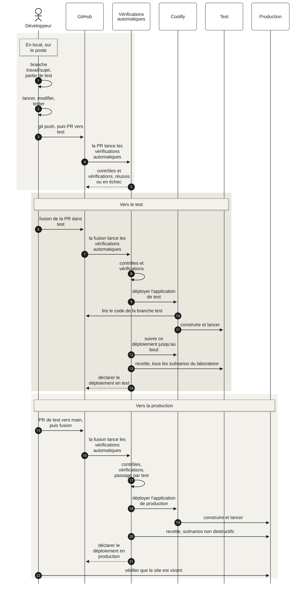

# Le cycle pas à pas

Le chemin d'une modification, du poste du développeur jusqu'à la production. Il
est le même pour toutes les applications, et **il n'a pas de raccourci**: une
correction urgente le suit aussi.



En mots: on travaille sur une branche `travail/<sujet>`, partie de `test`. On
ouvre une PR vers `test`; les vérifications automatiques de GitHub la
contrôlent, sans rien construire ni mettre en ligne. À la fusion, elles
construisent l'image de l'application **une seule fois**, la rangent dans
**Harbor**, l'entrepôt des images, et la mettent en ligne en test. On ouvre
ensuite une PR de `test` vers `main`, qui vérifie seulement que cette image
existe et a tourné en test; à sa fusion, **la même image** est mise en ligne en
production, sans rien reconstruire ni retester (plan 17, depuis le 04/10/2026).

Source du schéma: [`schemas/02-trajet-d-une-modification.mmd`](schemas/02-trajet-d-une-modification.mmd).

Cette page donne les commandes. Ce qui se passe derrière, à chaque étape (qui
parle à qui, dans quel ordre, ce qui arrête tout, les étiquettes, le retour en
arrière), avec un schéma par étape:
[comment une modification arrive en production](01-comment-une-modification-arrive-en-production.md).

## Comment lire les commandes

Ce qui est entre `<` et `>` est à remplacer, sans les chevrons:

| Dans la commande | À remplacer par | Exemple |
|---|---|---|
| `<dépôt>` | le nom du dépôt | `oscar-infrastructure` |
| `<sujet>` | un nom court pour son travail, en minuscules, avec des tirets, sans accent | `ajouter-champ-ttl` |
| `<nom>` | le nom de l'application dans son adresse | `dns` |
| `<application>` | le nom de l'application dans Coolify | `outil-dns` |

Les noms de chaque application sont sur [sa page](08-les-applications/README.md).
Les commandes sont des commandes git ou Docker, écrites pour être les mêmes sur
tous les systèmes. Elles ont été éprouvées **sous Linux seulement** (Ubuntu
26.04, Docker Engine 29.8 et son module compose 5.5, git 2.53), le 25 septembre
2026. Sous macOS et Windows, avec Docker Desktop: **non vérifié**. Qui les
essaie sous l'un d'eux et trouve un écart le signale, pour que ce guide le
dise.

## Où en est le cycle aujourd'hui

**État au 4 octobre 2026, 11h27 UTC**, relevé de 11h24 à 11h27 UTC par l'API
de Coolify, l'API de GitHub, Harbor et une requête à chaque site. C'est **le
seul tableau d'état du guide**: les autres pages y renvoient au lieu de le
recopier, pour qu'il ne se contredise jamais. Il se met à jour à chaque
livraison, relevé et non de mémoire. La colonne de la console
d'administration est relevée le 5 octobre 2026, de 06h19 à 06h21 UTC, par
l'API de Coolify, Harbor et une requête à chaque site.

| Pièce | Outil DNS | Laboratoire | Portail | Console d'administration |
|---|---|---|---|---|
| La branche `test` | en place | en place | en place | en place |
| Les vérifications automatiques de GitHub, dans `.github/workflows/` | sur `test` et `main`, sur le déploiement automatique commun par image | sur `test` et `main`, idem | sur `test` et `main`, idem | sur `test` et `main`, idem, une tâche par application |
| Les applications Coolify | `outil-dns-test`, `outil-dns-production`, en service, en mode image | `labo-test`, `labo-production`, en service, en mode image | `portail-test`, `portail-production`, en service, en mode image | `console-admin-api-test`, `console-admin-api-production`, `console-admin-interface-test`, `console-admin-interface-production`, en service, en mode image |
| L'image en service dans Harbor, **la même en test et en production** | `contenu-9438e947dc23` (`oscar/outil-dns-api`, `oscar/outil-dns-interface`) | `contenu-fa85a4f15def` (`oscar/laboratoire-visualiseur`, `oscar/laboratoire-collecteur`) | `contenu-093b638ca881` (`oscar/portail-portail`) | `contenu-ceae23770639` (`oscar/console-admin-api`), `contenu-4cc1b2c168b6` (`oscar/console-admin-interface`) |
| Mise en ligne en test, puis en production | 04/10 10h15, puis 10h38 | 04/10 10h20, puis 10h42 | 04/10 10h32, puis 10h54 | l'API 05/10 05h49, puis 06h14; l'interface 05/10 05h51, puis 06h15 |
| La recette par le laboratoire | lancée à la main (décision 98) | lancée à la main | pas branchée: le laboratoire n'a pas encore de scénario du portail | pas branchée: le laboratoire vise encore l'ancienne console |
| Les sites | `test-dns`, `dns` et leur API de santé répondent | `test-labo`, `labo` répondent `401` sans identifiants, `/sante` `200` | `test-tech`, `tech` et leurs routes de disponibilité répondent `200`; la connexion part vers GitHub | `test-console`, `console` et leur cockpit `/xr/` répondent `200`; la santé de `test-api-console` et `api-console` répond `"database":"ok"` |

Les heures sont celles des mises en ligne réussies, lues dans les étiquettes
`en-test-depuis-le-...` et `en-production-depuis-le-...` de Harbor. Une
fusion qui ne change pas le contenu de l'application (la documentation, par
exemple) ne reconstruit rien et ne remet rien en ligne: les branches peuvent
porter des commits plus récents que l'image en service.

La construction, le rangement dans Harbor, la mise en ligne et le contrôle
que la production reçoit l'image testée sont écrits **une fois**, dans le
déploiement automatique commun, rangé dans le dépôt `oscar-infrastructure`
(`.github/workflows/deploiement-par-image-harbor.yml`), que les vérifications
automatiques de chaque dépôt appellent. Ce que fait chaque exécution, en
détail: le « parcours de mise en ligne » de la documentation du déploiement
(fiche « Le déploiement » du portail). Les commandes git des étapes 1, 2, 5
et 6 marchent dans les trois dépôts.

## Les branches



- **`main`** porte la production. On n'y envoie jamais rien directement.
- **`test`** porte l'environnement de test. On n'y envoie jamais rien
  directement non plus: tout y arrive par une PR.
- **`travail/<sujet>`** est la branche de travail d'une personne, pour un
  sujet. Elle part de `test` et y revient par une PR.

Sur le schéma, `travail/ajouter-champ` a été fusionnée dans `test`, déployée
en test, puis passée en production par la PR de `test` vers `main`.
`travail/corriger-lien`, partie du `test` à jour, est encore en cours.

Un sujet, une branche. Deux sujets sans rapport font deux branches et deux PR:
elles se vérifient, se fusionnent et s'annulent séparément.

Source du schéma: [`schemas/03-les-branches.mmd`](schemas/03-les-branches.mmd).

## Étape 1. Cloner le dépôt

```
git clone https://github.com/oscar-organisation/<dépôt>.git
cd <dépôt>
```

**Ce qu'on doit voir**: un dossier `<dépôt>`, avec un `LISEZ-MOI.md` à sa
racine.

**Si ça ne va pas**:

- `Repository not found`: le compte GitHub n'a pas accès à l'organisation, ou
  le nom du dépôt est mal écrit. Les noms sont dans [Commencer ici](README.md), partie « Les dépôts ».
- GitHub demande un mot de passe: il attend un jeton personnel, pas le mot de
  passe du compte. On le crée sur GitHub, dans Settings, Developer settings,
  Personal access tokens.

On ne clone qu'une fois. Pour un nouveau sujet, on reprend à l'étape 2.

## Étape 2. Créer sa branche depuis `test`

```
git fetch origin
git switch --no-track -c travail/<sujet> origin/test
```

`git fetch` ramène l'état de GitHub. La branche part donc du `test` du moment,
pas d'une copie ancienne. `--no-track` évite qu'un `git push` sans argument
parte un jour vers `test`.

**Ce qu'on doit voir**: `Switched to a new branch 'travail/<sujet>'`.

**Si ça ne va pas**: `invalid reference: origin/test` veut dire que la branche
`test` n'existe pas dans ce dépôt. Elle existe dans les trois dépôts du cycle
depuis le 25 septembre 2026; ailleurs, le dépôt ne suit pas encore le cycle.

## Étape 3. Lancer l'application en local

Dans le dossier de l'application, donné par [sa page](08-les-applications/README.md):

```
docker compose up --build -d
docker compose ps
```

`--build` reconstruit les images avec le code du moment. `-d` rend la main au
terminal pendant que l'application tourne.

**Ce qu'on doit voir**: après quelques dizaines de secondes, chaque service est
`Up` et `(healthy)` dans la colonne `STATUS` de `docker compose ps`. La colonne
`PORTS` montre des ports publiés sur `127.0.0.1`, dans le bloc de l'application
(voir [les ports locaux](04-les-environnements.md#les-ports-locaux)).
L'application s'ouvre à l'adresse donnée sur sa page.

Pour la vérifier sans navigateur, depuis un conteneur jetable, par sa route
de santé si elle en a une (sa page la donne):

```
docker run --rm --network host curlimages/curl:8.22.0 -fsS http://127.0.0.1:<port>/<route de santé>
```

**Sous Linux, `--network host` est nécessaire**: sans lui, le conteneur a sa
propre adresse `127.0.0.1`, et répond `Could not connect to server` (mesuré le
26 septembre 2026). Sous macOS et Windows: non vérifié.

**Si ça ne va pas**:

- `docker compose logs <service>` montre ce que le service a écrit. Le nom des
  services est dans la colonne `SERVICE` de `docker compose ps`.
- `port is already allocated`: un autre programme tient déjà ce port. `docker
  compose ls` liste les applications lancées par Docker; on arrête celle qui
  gêne, dans son dossier, par `docker compose down`.

Pour arrêter l'application: `docker compose down`. **Jamais `docker compose
down -v`** sans savoir ce qu'on fait: `-v` efface les volumes, donc les
données.

## Étape 4. Tester en local

Deux sortes de tests, dans cet ordre:

1. **Les tests de l'application**, propres à elle. La commande est sur sa page.
   Ils tournent en conteneur, comme tout le reste.
2. **Le laboratoire**, qui rejoue les parcours dans un vrai navigateur, contre
   l'application lancée à l'étape 3. Le laboratoire tourne lui aussi en
   conteneur, depuis le dépôt `oscar-test`.

**Ce qu'on doit voir**: tous les tests réussissent. On n'envoie rien tant
qu'un test échoue.

Les commandes de test de chaque application sont sur sa page. Pour le
laboratoire contre l'application lancée sur le poste:

```
docker compose run --rm labo lancer --niveau local --app <application>
```

depuis le dossier `oscar_labo_test_application/` du dépôt `oscar-test`. **Sous
Linux**, `host.docker.internal` seul ne joint pas un port publié sur
`127.0.0.1`: on ajoute, dans le terminal, `export LABO_MODE_RESEAU=host
LABO_HOTE_LOCAL=127.0.0.1` avant la commande (incident `INC-2026-09-25-13`).
Sous macOS et Windows: non vérifié. Le détail est dans le guide du laboratoire,
[`oscar_labo_test_application/README.md`](https://github.com/oscar-organisation/oscar-test/blob/main/oscar_labo_test_application/README.md),
partie « Le niveau local sous Linux », et sur [sa page](08-les-applications/laboratoire.md).

## Étape 5. Enregistrer et pousser

```
git status
git add <fichiers>
git commit -m "<message>"
git push -u origin travail/<sujet>
```

`git status` montre ce qui a changé: on vérifie qu'aucun fichier ne part par
erreur. Le message dit ce que fait le changement, en français, en commençant
par un verbe: « Ajouter le champ TTL au formulaire ». Voir
[les messages de commit](03-comment-se-comporter.md#6-des-messages-de-commit-clairs).

`-u` n'est utile qu'au premier envoi: il relie la branche locale à celle de
GitHub. Les fois suivantes, `git push` suffit.

**Ce qu'on doit voir**: GitHub répond par une ligne
`remote: Create a pull request for 'travail/<sujet>' on GitHub by visiting:`,
suivie d'une adresse.

**Si ça ne va pas**: `Updates were rejected` veut dire que la branche a reçu
sur GitHub des commits qu'on n'a pas en local. `git pull`, puis `git push`.

## Étape 6. Ouvrir la PR vers `test`

Une PR (pull request, demande de fusion) propose de fusionner sa branche dans
une autre. On l'ouvre sur GitHub, à cette adresse:

```
https://github.com/oscar-organisation/<dépôt>/compare/test...travail/<sujet>?expand=1
```

On y écrit un titre, qui dit ce que fait le changement, et une description:
pourquoi ce changement, et comment on l'a testé.

**Ce qu'on doit voir**: en haut de la page, `base: test` et
`compare: travail/<sujet>`. Après création, la PR montre la liste des
vérifications automatiques, qui tournent.

**Si ça ne va pas**:

- `base: main`: c'est la branche que GitHub propose par défaut. On choisit
  `test`. Une PR de travail vers `main` ne se fusionne jamais.
- `There isn't anything to compare`: la branche n'a pas été poussée, ou elle
  n'a aucun commit de plus que `test`.

## Étape 7. Les vérifications automatiques contrôlent la PR

GitHub lance les « Vérifications rapides », puis les « Tests du code » (pour
le portail, les « Tests du code dans l'image », une étape de son Dockerfile).
Rien n'est construit pour Harbor ni mis en ligne à ce stade. Un résumé de
l'exécution arrive en commentaire dans la PR, « Vérifications automatiques:
le résumé », mis à jour à chaque exécution. Le détail des tâches:
[les vérifications automatiques](05-les-verifications-automatiques.md).

**Ce qu'on doit voir**: sur la PR, chaque vérification réussit. Le détail
est dans l'onglet Actions du dépôt:
`https://github.com/oscar-organisation/<dépôt>/actions`.

**Si ça ne va pas**: une vérification en échec. On clique sur « Details » à
côté d'elle, on lit le premier message d'erreur, on corrige sur la même
branche et on pousse: les vérifications automatiques repartent seules. Voir
[comment se comporter](03-comment-se-comporter.md), règle 7, « Quand une
vérification automatique échoue ».

## Étape 8. Fusionner dans `test`

Quand les vérifications automatiques ont réussi, on fusionne la PR par le
bouton « Merge pull
request », en choisissant **« Create a merge commit »**. Puis on supprime la
branche sur GitHub par le bouton « Delete branch ».

Pourquoi « Create a merge commit », et jamais « Squash » ni « Rebase »: ces
deux-là fabriquent sur la branche d'arrivée des commits qui n'existent pas sur
la branche de départ. Les PR suivantes affichent alors des changements déjà
fusionnés, et deviennent confuses.

**Ce qu'on doit voir**: la PR passe à l'état `Merged`, et une nouvelle
exécution des vérifications automatiques démarre sur la branche `test`, dans
l'onglet Actions.

## Étape 9. La mise en ligne automatique en test

Sur la branche `test`, les vérifications automatiques refont les vérifications
rapides et les tests, puis la tâche « Construire, ranger et mettre en ligne »:

1. « Décider »: elle calcule l'**empreinte du contenu** du dossier de
   l'application (sans la documentation), et regarde dans Harbor si l'image
   `contenu-<empreinte>` existe déjà;
2. « Construire l'image et la ranger dans Harbor (une seule fois) »: seulement
   si elle manque; l'image est contrôlée avant d'être rangée;
3. « Sécurité: lecture des failles par Trivy (informe, ne bloque pas) »;
4. « Mettre en ligne et vérifier la santé »: elle pose l'étiquette de l'image
   sur l'application Coolify `<application>-test`, demande la mise en ligne,
   la suit, puis vérifie que l'adresse de santé répond; enfin elle note dans
   Harbor `en-test-depuis-le-<date>`.

Coolify ne construit rien: il télécharge l'image dans Harbor et la lance
(une douzaine de secondes pour l'outil DNS et le laboratoire, 30 s pour le
portail, mesurées le 04/10/2026). Personne ne met en ligne à la main.

**Ce qu'on doit voir**:

- dans l'onglet Actions, l'exécution de `test` réussie, et son résumé:
  l'image, « Construite cette fois » (ou « non: déjà rangée dans Harbor »), les
  failles par niveau, « Mise en ligne » avec la santé vérifiée;
- dans la page Deployments du dépôt,
  `https://github.com/oscar-organisation/<dépôt>/deployments`, l'environnement
  `<application>-test`;
- dans Coolify, projet `<application>`, environnement `test`, une mise en
  ligne terminée, sans construction dans son journal;
- le site `https://test-<nom>.oscar-bot.com` qui répond.

**Si ça ne va pas**: le résumé dit quelle tâche a échoué, et que rien n'a été
mis en ligne. Le journal de la tâche en échec, dans l'onglet Actions, donne le
premier message d'erreur (une construction ratée, un contrôle de l'image, la
réponse de Coolify, une santé qui ne vient pas). Une image illisible fait
échouer la mise en ligne **avant** l'arrêt de l'ancienne version, qui reste en
service.

Où c'est en place: le tableau d'[où en est le cycle](#ou-en-est-le-cycle-aujourdhui), au début de cette page.

## Étape 10. La recette par le laboratoire, à la main

Depuis le 04/10/2026, la recette n'est plus jouée après chaque mise en ligne
(décisions 91 et 98): on la lance quand le changement le demande. Onglet
Actions du dépôt `oscar-test`, « Recette (laboratoire) », « Run workflow »:
le niveau `test` et l'application. Elle joue les scénarios du laboratoire qui
concernent l'application, contre `https://test-<nom>.oscar-bot.com`.

**Ce qu'on doit voir**: l'exécution de la recette réussie, et son rapport dans
le visualiseur du laboratoire, `https://test-labo.oscar-bot.com`.

**Si ça ne va pas**: le changement est en test, mais il n'est pas validé. On ne
va pas plus loin: on corrige par une nouvelle branche `travail/<sujet>`, qui
refait les étapes 2 à 10.

## Étape 11. La PR de `test` vers `main`

Quand la mise en ligne en test (et, s'il y a lieu, la recette) a réussi, on
propose de passer ce contenu en production:

```
https://github.com/oscar-organisation/<dépôt>/compare/main...test?expand=1
```

**Ce qu'on doit voir**: `base: main` et `compare: test`. Les vérifications
automatiques ne refont ni tests ni construction: après les vérifications
rapides, « Décider » vérifie en quelques secondes que l'image
`contenu-<empreinte>` existe dans Harbor et qu'elle a été mise en ligne en
test; le résumé dit « Image testée: retrouvée, déjà mise en ligne en test ».
On fusionne ensuite par **« Create a merge commit »**. On ne supprime jamais
la branche `test`.

**Si ça ne va pas**: « Décider » refuse net si l'image manque, ou n'a jamais
été mise en ligne en test: ce contenu n'est pas passé par `test`. On ne
fusionne pas; on cherche ce qui est arrivé sur `test` (une exécution en échec,
un envoi direct).

## Étape 12. La mise en ligne automatique en production

Sur `main`, les vérifications automatiques refont les vérifications rapides,
puis « Décider » **retrouve l'image testée** par l'empreinte du contenu: la
fusion de `test` dans `main` ne change pas le contenu, donc pas l'empreinte.
**La même image** est mise en ligne sur `<application>-production`, puis la
santé est vérifiée, et Harbor note `en-production-depuis-le-<date>`. Ni tests,
ni construction, ni Trivy (une minute environ de bout en bout pour l'outil DNS
et le laboratoire, mesurée le 04/10/2026).

**Ce qu'on doit voir**: l'exécution de `main` réussie dans l'onglet Actions et
son résumé, l'environnement `<application>-production` dans la page
Deployments, la mise en ligne terminée dans Coolify, environnement
`production`, sans construction.

**Si ça ne va pas**: « Décider » refuse net si l'image du contenu de `main`
manque dans Harbor: `main` porterait autre chose que ce qui a été testé, et
**rien n'est mis en ligne**. Quelqu'un a envoyé directement sur `main`, ou la
mise en ligne en test avait échoué. On prévient Joel, et on rédige l'incident.
Voir [comment se comporter](03-comment-se-comporter.md), règles 1 et 7.

## Étape 13. Vérifier que le site est vivant

```
docker run --rm curlimages/curl:8.22.0 -fsSL -o /dev/null -w "%{http_code}\n" https://<nom>.oscar-bot.com
```

Cette commande appelle le site depuis un conteneur jetable et affiche le code
de la réponse. Pour une application lancée sur le poste, voir l'étape 3: sous
Linux, le conteneur a besoin de `--network host` pour joindre `127.0.0.1`. Une application qui a une route de santé se vérifie aussi par
elle; sa page donne la commande.

**Ce qu'on doit voir**: le code attendu par l'application. Pour le visualiseur
du laboratoire, la racine répond `401` sans identifiants; sa route `/sante`
doit répondre `200`. Les pages de chaque application donnent les adresses à
vérifier. Ne pas conclure à une panne sur le seul refus d'un accès protégé.

Puis on vérifie que c'est la bonne version: l'image que Coolify fait tourner
porte l'étiquette `contenu-<empreinte>` du contenu de `main`, et c'est la même
qu'en test. Le dernier commit de `main` peut être plus récent si seule la
documentation a changé: l'empreinte ne bouge pas. Un retour en arrière fait à
la main peut aussi faire tourner une autre image, jusqu'à la prochaine
exécution. La page « Vérifier » de chaque application, dans la documentation
du déploiement, donne les commandes (dont l'empreinte du contenu recalculée à
la main). Pour lire le dernier commit de la branche:

```
git fetch origin
git rev-parse --short origin/main
```

**Si ça ne va pas**:

- `TLS connect error` et `unrecognized name`: le proxy du serveur ne connaît
  pas ce nom, rien n'y est déployé. Mesuré le 25 septembre 2026 sur
  un nom de test avant sa création dans Coolify; cet exemple est historique.
- `503`: le proxy connaît le nom, mais l'application ne répond pas. Regarder
  son état dans Coolify.

## Tenir sa branche à jour

Si `test` a avancé pendant qu'on travaillait:

```
git fetch origin
git merge origin/test
```

En cas de conflit, git nomme les fichiers en cause. On les corrige, puis
`git add <fichiers>` et `git commit`. Jamais de `git push --force` sur `test`
ou sur `main`.

## Annuler une modification déjà fusionnée

On ne réécrit pas l'histoire de `test` ni de `main`. On ajoute un commit qui
défait le changement, par le même cycle:

```
git fetch origin
git switch --no-track -c travail/annuler-<sujet> origin/test
git revert -m 1 <commit de fusion>
git commit --amend -m "Annuler <ce que faisait la fusion>, parce que <pourquoi>"
git push -u origin travail/annuler-<sujet>
```

`<commit de fusion>` est le commit créé par la fusion de la PR, visible sur la
PR elle-même. `git revert` propose un message en anglais, « Revert "..." »:
`git commit --amend` le remplace par un message en français, qui dit ce qu'on
annule et pourquoi (règle des [messages de commit](03-comment-se-comporter.md#6-des-messages-de-commit-clairs)).
On ouvre ensuite une PR vers `test`, comme à l'étape 6.

Le contenu revenu à l'ancien retrouve son ancienne empreinte: l'image existe
déjà dans Harbor (les 10 dernières sont gardées), **rien n'est reconstruit**,
et elle est remise en ligne en test, puis en production.

Remettre en service une version précédente **en quelques secondes**, sans
attendre le cycle, se fait par l'étiquette d'une image déjà rangée dans
Harbor: c'est une procédure d'exploitation, écrite dans le dossier du
déploiement du dépôt `oscar-infrastructure`
(voir [le code et l'exploitation](06-le-code-et-l-exploitation.md)):
`docs/mise-en-ligne/PROCEDURE-revenir-en-arriere-par-l-etiquette-v1.0.md`, et,
pour chaque application, `docs/applications/<application>/revenir-en-arriere.md`.
Elle n'est pas entre les mains du développeur, et elle ne dure que jusqu'à la
prochaine exécution sur la branche: l'annulation par le cycle, ci-dessus, la
rend durable.
