# Comment se comporter

Les règles de l'équipe, pour toute personne qui touche au code d'OSCAR. Elles
sont courtes. Chacune dit pourquoi elle existe: presque toutes viennent d'un
incident réel, rangé dans le dépôt `oscar-gestion-incidents-and-reports`.

Avant tout: lire
[`LECONS-A-RESPECTER.md`](https://github.com/oscar-organisation/oscar-gestion-incidents-and-reports/blob/main/LECONS-A-RESPECTER.md),
en entier. Cette page en reprend ce qui concerne le développement.

## 1. Jamais d'envoi direct sur main

On n'envoie jamais rien directement sur `main`, ni sur `test`. Tout passe par
une PR: d'une branche `travail/<sujet>` vers `test`, puis de `test` vers
`main`.

**Pourquoi.** `main` porte la production et `test` l'environnement de test. Au
plan gratuit de GitHub, qui est celui de l'organisation, on ne peut pas
interdire techniquement un envoi sur `main`, et Joel a choisi de ne pas prendre
de compte payant pour l'instant: passer par `test` avant `main` est **une règle
de conduite de l'équipe** (décision 63). La chaîne signale tout déploiement en
production dont le contenu n'est pas passé par `test`, mais elle ne l'empêche
pas. C'est donc à chacun de ne pas le faire.

Jamais non plus de `git push --force` sur `test` ou `main`, ni de suppression de
ces deux branches.

## 2. Jamais de déploiement à la main

On ne déploie jamais soi-même: ni par le bouton « Deploy » de Coolify, ni par
un `docker compose up` sur le serveur. C'est la chaîne qui déploie, et elle
seule.

**Pourquoi.** Le déploiement est la dernière tâche de la chaîne, et il dépend
de toutes les autres. Quand Coolify déployait tout seul à chaque envoi, trois
envois aux tests rouges sont partis en production (incident
`INC-2026-09-25-02`).

## 3. Rien à installer en dehors de git et Docker

Sur son poste, on n'installe que git et Docker. Python, Node, les navigateurs
de test, les outils de vérification: tout tourne dans un conteneur, lancé par
`docker compose` ou `docker run`.

**Pourquoi.** Un outil installé sur une machine ne marche plus sur la suivante,
et fait croire qu'une chose marche alors qu'elle ne marche que là. Des outils
installés directement sur le serveur ont déjà causé deux incidents
(`INC-2026-09-24-01`, `INC-2026-09-24-03`).

Si une commande du guide demande un outil qu'on n'a pas, c'est une faute du
guide: la signaler, plutôt qu'installer l'outil.

## 4. Aucun secret dans un envoi

Aucun mot de passe, jeton, clé privée ou identifiant de fournisseur dans un
commit, une PR, un ticket ou une capture d'écran. **Seule exception**: les
fichiers `.env` de développement, que l'équipe versionne par décision de Joel
(décision 46, du 23 septembre 2026). Chacun a un `.env.exemple` à côté, qui
explique chaque réglage.

**Pourquoi.** Un secret envoyé sur GitHub reste dans l'historique, même si on
l'efface au commit suivant.

**Si c'est arrivé**: le dire tout de suite, ne pas essayer de l'effacer
discrètement, et rédiger l'incident (règle 8).

On n'affiche jamais non plus la valeur d'un secret: ni dans un terminal
partagé, ni dans un journal, ni dans un message.

## 5. Tester avant d'envoyer

Avant chaque envoi: lancer l'application en local, ses tests, et le
laboratoire contre elle ([le cycle](02-le-cycle-pas-a-pas.md), étapes 3 et 4).
On n'envoie rien de rouge.

**Pourquoi.** La chaîne revérifie tout, mais une vérification qui échoue sur
GitHub coûte un aller-retour de plusieurs minutes, et bloque les autres qui
attendent `test`.

Un test nouveau doit avoir été vu échouer une fois: sinon rien ne dit qu'il
vérifie quelque chose.

## 6. Des messages de commit clairs

Un commit fait une chose. Son message la dit, en français, en commençant par un
verbe à l'infinitif, et en disant pourquoi si ce n'est pas évident:

```
Ajouter le champ TTL au formulaire d'enregistrement
Corriger le port de l'interface, qui ne suivait pas la convention
Sortir le déploiement du dépôt de code, décision 59
```

À éviter: `fix`, `wip`, `modifs`, `suite`. Ils ne disent rien à la personne qui
cherchera dans six mois pourquoi une ligne a changé.

L'auteur d'un commit est la personne qui l'a écrit, par son identité git. Aucune
ligne d'attribution à un outil n'est ajoutée au message, ni dans la description
d'une PR (leçon 1.3 de `LECONS-A-RESPECTER.md`). On relit chaque message avant
de valider.

## 7. Quand la chaîne est rouge



**Toujours**: ouvrir la tâche rouge dans l'onglet Actions, lire le premier
message d'erreur, refaire la même vérification en local, en conteneur, et
corriger. La correction suit le cycle, comme tout changement.

**Selon l'endroit**:

- **Sur une PR**: c'est le rôle de la chaîne, rien n'est cassé. On corrige sur
  la même branche et on pousse; la chaîne repart seule.
- **Après une fusion dans `test`**: l'environnement de test est touché, et
  d'autres en dépendent. La réparer passe avant tout autre travail. Si la
  correction n'est pas immédiate, on annule le changement
  ([le cycle](02-le-cycle-pas-a-pas.md), partie « Annuler une modification
  déjà fusionnée »). On rédige l'incident.
- **Après une fusion dans `main`**: la production est concernée. On prévient
  Joel tout de suite, puis on suit le même chemin. On rédige l'incident.
- **Un avertissement du contrôle de passage par `test`**, même sur une passe
  verte: un contenu est parti en production sans être passé par le test. C'est
  une règle enfreinte: on prévient Joel et on rédige l'incident.

**Jamais**: désactiver ou affaiblir un contrôle pour le faire passer au vert,
relancer la chaîne en boucle en espérant un autre résultat, déployer à la main,
envoyer directement sur `main`.

Un test qui échoue n'a pas forcément tort: il est peut-être périmé. On le
confronte au code avant de le corriger, et si c'est lui qu'on corrige, on dit
pourquoi dans son en-tête (leçon 8.3).

Source du schéma: [`schemas/06-quand-la-chaine-est-rouge.mmd`](schemas/06-quand-la-chaine-est-rouge.mmd).

## 8. Un incident se rédige le jour même

Tout incident est écrit **le jour même** dans le dépôt
`oscar-gestion-incidents-and-reports`, dans le dossier du dépôt concerné
(`incidents_<dépôt>`, ou `incident_general` pour la machine, le réseau ou le
DNS):

1. créer le dossier `<N>-incident-<JJ-MM-AAAA>-<HH>h<MM>`, heure de détection en
   UTC, à partir des deux modèles de `modeles/`;
2. recopier les messages d'erreur **tels quels**: la personne qui retombera
   dessus doit trouver le rapport en les cherchant;
3. ajouter la ligne dans `INDEX.md`;
4. reporter la règle tirée de l'incident dans `LECONS-A-RESPECTER.md`.

Le détail est dans le
[`LISEZ-MOI.md`](https://github.com/oscar-organisation/oscar-gestion-incidents-and-reports/blob/main/LISEZ-MOI.md)
de ce dépôt.

**Pourquoi le jour même.** Deux jours plus tard, les heures, les messages exacts
et les fausses pistes sont perdus (décision 54).

Un incident, ce n'est pas seulement une panne: c'est aussi une consigne
enfreinte, une affirmation fausse, un rapport qui disait autre chose que la
réalité.

## 9. Ne rien supprimer sans accord

On ne supprime jamais, sans l'accord de Joel: le dossier `code/` d'une machine,
un dépôt, une branche `test` ou `main`, une application Coolify, un volume de
données. Et jamais sans sauvegarde vérifiée avant.

**Pourquoi.** Tout n'est pas sous gestion de versions. Une suppression est
parfois définitive (décision 16). Attendre une réponse ne coûte rien.

## 10. Vérifier avant d'affirmer

On ne dit qu'une chose marche qu'après l'avoir constaté: la page s'ouvre, le
test est vert, le nom répond. Une commande qui ne dit rien n'a rien prouvé: on
relit l'état après coup. Ce qu'on n'a pas vérifié, on l'écrit « non vérifié ».

**Pourquoi.** Plusieurs incidents viennent d'une réussite annoncée qui n'avait
pas eu lieu (`INC-2026-09-24-04`, `INC-2026-09-25-03`). Un rapport faux est pire
qu'un rapport absent.

## 11. Un fichier fabriqué ne se corrige pas à la main

Un fichier produit par un outil (une image de schéma, un fichier généré par un
script) se corrige en corrigeant sa source, puis en relançant l'outil. Jamais
en le retouchant.

**Pourquoi.** Sinon le fichier et sa source divergent, et la prochaine
génération efface la correction sans que personne ne le voie
(`INC-2026-09-25-08`).
