# Les environnements

Une application OSCAR vit à trois endroits: sur le poste du développeur, en
test, et en production. Les deux derniers sont sur le serveur, déployés par
Coolify (décision 56).

Source du schéma: [`schemas/05-les-environnements.mmd`](schemas/05-les-environnements.mmd).

## Les trois niveaux

| Niveau | Où | Branche | Qui le lance | Adresse |
|---|---|---|---|---|
| **local** | le poste du développeur | `travail/<sujet>` | le développeur, par `docker compose up` | `http://127.0.0.1:<port>` |
| **test** | le serveur, environnement `test` de Coolify | `test` | les vérifications automatiques de GitHub, à chaque fusion dans `test` | `https://test-<nom>.oscar-bot.com` |
| **production** | le serveur, environnement `production` de Coolify | `main` | les vérifications automatiques de GitHub, à chaque fusion dans `main` | `https://<nom>.oscar-bot.com` |

Le test et la production tournent sur le même serveur, côte à côte. C'est
possible parce qu'aucune application ne publie de port sur le serveur: le proxy
les joint par le réseau interne de Docker (voir plus bas).

## Les noms

La règle est la même pour toutes les applications:

| Quoi | Production | Test |
|---|---|---|
| Adresse | `<nom>.oscar-bot.com` | `test-<nom>.oscar-bot.com` |
| Branche | `main` | `test` |
| Projet Coolify | un par application | le même |
| Environnement Coolify | `production` | `test` |
| Application Coolify | `<application>-production` | `<application>-test` |
| Environnement GitHub | `<application>-production` | `<application>-test` |

Le nom `*.oscar-bot.com` mène déjà au serveur: une nouvelle adresse ne demande
aucun enregistrement DNS. Le certificat de chaque adresse est obtenu tout seul
par le proxy du serveur.

L'environnement GitHub est ce que les vérifications automatiques déclarent à
chaque déploiement, pour qu'on voie sur GitHub ce qui est en test et en
production. Il porte le nom de
l'application Coolify (`outil-dns-test`, `portail-production`...), parce qu'un
dépôt peut porter plusieurs applications (décision A21). Chacun garde la
variable `COOLIFY_APPLICATION`, l'identifiant de son application dans Coolify:
aucun identifiant n'est écrit dans les fichiers des vérifications
automatiques. Le plan gratuit de GitHub les permet sur un dépôt privé (mesuré
au lot 2).

## Les trois applications

| Application | Dépôt, dossier | Production | Test | Projet Coolify | Applications Coolify |
|---|---|---|---|---|---|
| Outil DNS | `oscar-infrastructure`, `oscar_infra_dns/` | `dns`, `api-dns` | `test-dns`, `test-api-dns` | `outil-dns` | `outil-dns-production`, `outil-dns-test` |
| Laboratoire de tests | `oscar-test`, `oscar_labo_test_application/` | `labo` | `test-labo` | `labo` | `labo-production`, `labo-test` |
| Portail Backstage | `oscar-general-gouvernance-project`, `oscar_backstage/` | `tech` | `test-tech` | `portail` | `portail-production`, `portail-test` |

Toutes les adresses sont sous `oscar-bot.com`.

Ce qui est en service aujourd'hui, application par application: le tableau
d'[où en est le cycle](02-le-cycle-pas-a-pas.md#ou-en-est-le-cycle-aujourdhui).

## Les variables, trois niveaux

Une variable d'environnement est un réglage donné à l'application au moment où
elle démarre: une adresse, un port, un mot de passe. Chaque niveau a les
siennes, à un endroit précis:

| Niveau | Où vivent les valeurs | Les secrets |
|---|---|---|
| local | le fichier `.env` du dépôt, et `compose.override.yaml` pour les ports | **aucun secret n'est nécessaire pour développer** |
| test | les variables de l'application Coolify `<application>-test` | propres au test, jamais ceux de la production |
| production | les variables de l'application Coolify `<application>-production` | leur source de vérité est `secret_root/`, sur le serveur |

Chaque dépôt décrit ses variables dans son `.env.exemple`: pour chacune, son
rôle et son niveau. Une variable qui n'y est pas n'existe pas.

**Aucune variable OVH n'est jamais posée sur un environnement de test.** OVH
est le fournisseur du domaine, et sa clé actuelle donne accès à toutes les
zones DNS du compte. Seul l'outil DNS de production pourra un jour s'en servir.

Le développeur ne voit ni les variables de test ni celles de production: elles
vivent dans Coolify et sur le serveur. Il n'en a pas besoin pour travailler.

## Les ports locaux

En local, chaque application publie ses ports sur le poste, pour qu'on l'ouvre
dans un navigateur. Pour que deux applications lancées côte à côte ne se
disputent jamais un port, chacune a **un bloc de cent ports**, dans la plage
OSCAR, 18000 à 18999:

| Bloc | Application | Ports | État |
|---|---|---|---|
| `180xx` | réservé à un outil commun à plusieurs applications | aucun | libre |
| `181xx` | outil DNS | `18100` API, `18101` interface | en place |
| `182xx` | console d'administration | `18200` console, `18201` authentification | réservés |
| `183xx` | Coolify | réservé | Coolify tourne en réalité sur d'autres ports, voir la convention |
| `184xx` | laboratoire de tests | `18400` visualiseur de rapports | en place |
| `185xx` | portail Backstage | `18500` service, `18501` et `18502` mode développement | en place |
| `186xx` à `189xx` | libres | | |

Trois règles:

- **Toujours sur `127.0.0.1`**: le port n'est joignable que depuis le poste
  lui-même, jamais depuis le réseau.
- **Un port publié se déclare dans `compose.override.yaml`, jamais dans
  `compose.yaml`.** En local, `docker compose up` lit les deux fichiers et les
  fusionne sans qu'on demande rien. Coolify, lui, ne lit que `compose.yaml`: en
  production, aucun port n'est publié, et le test et la production peuvent
  tourner sur le même serveur.
- **Le port interne ne change pas**: c'est celui du cadre utilisé, 8000 pour
  une API Python, 3000 pour une interface Next.js, 7007 pour Backstage. Seul le
  port publié vient du bloc.

Ces règles viennent de la convention des ports du projet
(`_pilotage/09-CONVENTION-des-ports.md`, sur la machine du projet). Une
nouvelle application prend le premier bloc libre, écrit dans la convention
**avant** sa première ligne de `compose.override.yaml`.

Les ports publiés ne servent qu'en local. En test et en production, on passe
toujours par l'adresse `https://`, jamais par un port.
