# La chaîne

La chaîne est l'ensemble des vérifications automatiques qui tournent sur GitHub,
dans GitHub Actions, à chaque PR et à chaque fusion. **C'est elle qui déploie,
et elle seule.** Personne ne déploie à la main.

Source du schéma: [`schemas/04-la-chaine.mmd`](schemas/04-la-chaine.mmd).

## Ses quatre tâches

Le même patron dans les trois dépôts, dans le fichier
`.github/workflows/chaine.yml`:

| Tâche | Ce qu'elle fait | Durée |
|---|---|---|
| `controles` | refuse un commit qui porte une ligne d'attribution (décision A18), cherche des secrets, vérifie la typographie (ni tiret long, ni caractère points de suspension), valide les fichiers de la chaîne et la composition, telle que Coolify la lit et telle qu'on la lance en local | moins d'une minute |
| `verifs` | lance les tests propres à l'application, par exemple les tests du code, la construction des images, la charte graphique | selon l'application |
| `deploiement` | seulement après une fusion dans `test` ou dans `main`, et après toutes les autres, et seulement si le contenu à déployer a changé: demande le déploiement à Coolify et le suit jusqu'au bout | de quelques minutes à trois quarts d'heure, selon l'application |
| `recette` | joue les scénarios du laboratoire contre ce qui vient d'être déployé | selon l'application |

Chaque tâche attend la précédente. **Une tâche rouge arrête la chaîne**: les
suivantes ne partent pas, et rien n'est déployé.

## Ce qui se passe à chaque événement

| Événement | `controles` | `verifs` | `deploiement` | `recette` |
|---|---|---|---|---|
| PR vers `test`, ouverte ou mise à jour | oui | oui | non | non |
| Fusion dans `test` | oui | oui | en test, si le contenu à déployer a changé | tous les scénarios, contre `test-<nom>` |
| PR de `test` vers `main` | oui | oui | non | non |
| Fusion dans `main` | oui | oui | contrôle de passage par `test`, puis en production, si le contenu à déployer a changé | scénarios non destructifs, contre `<nom>` |

Une PR ne déploie jamais rien: elle montre seulement, sur sa page, si le
changement passe les vérifications.

**Le contenu à déployer**, c'est le dossier de l'application dans le dépôt
(décision 62), sans les fichiers qui ne changent rien à ce qui tourne: la
documentation (`*.md`) par défaut, et ce que chaque chaîne ajoute. Une fusion
qui ne touche que la documentation ne redéploie rien: le contenu est déjà en
service.

Contre la production, la recette ne joue que des scénarios **non destructifs**:
des scénarios qui lisent et vérifient, sans créer, modifier ni supprimer de
données réelles.

## Le contrôle de passage par test

L'organisation GitHub est au plan gratuit. Sur un dépôt privé, ce plan ne
permet pas de protéger `main`: n'importe qui ayant le droit d'écrire peut y
envoyer un commit. Joel a choisi de ne pas prendre de compte payant pour
l'instant: passer par `test` avant `main` est **une règle de conduite de
l'équipe** (décision 63).

La chaîne vérifie que cette règle a été suivie. Avant de déployer en
production, elle compare le contenu à déployer, le dossier de l'application
hors documentation, à celui qui est en service en test, déployé avec succès. Le
contenu, ce sont les fichiers, pas l'identifiant du commit: la fusion d'une PR
de `test` vers `main` crée un commit nouveau, avec les mêmes fichiers.

Si ce n'est pas le cas, **la chaîne ne bloque pas le déploiement: elle le
signale, en clair, dans le résumé de la passe**, pour que l'écart se voie. Un
tel avertissement veut dire qu'une règle a été enfreinte: on prévient Joel et on
rédige l'incident.

Le plan prévoyait d'abord une porte bloquante, « la porte de la production ».
Elle a été rendue non bloquante à la suite de la décision 63. La rendre de
nouveau bloquante ne demande qu'une ligne dans le workflow réutilisable, si
l'équipe le décide.

## Le déploiement, écrit une seule fois

La tâche `deploiement` n'est pas écrite trois fois. C'est **un seul workflow
réutilisable** (un morceau de chaîne qu'un autre dépôt appelle),
`.github/workflows/deployer.yml`, rangé dans le dépôt `oscar-infrastructure`
et appelé par chaque chaîne (lot 2). Il tient en deux tâches:

- **`preparer`** choisit l'environnement selon la branche (`test` pour `test`,
  `production` pour `main`), regarde si le contenu à déployer a changé depuis
  le dernier déploiement réussi, et, en production, fait le contrôle de passage
  par `test`. Elle ne déclare rien, et s'arrête là si rien n'a changé.
- **`deployer`**, seulement s'il faut déployer: elle attend que la machine
  n'ait **aucun** autre déploiement en cours, toutes applications confondues;
  demande le déploiement à Coolify et suit **celui-là**; vérifie que Coolify
  construit bien le commit vérifié, et annule sinon (la passe du nouvel envoi
  déploiera); puis vérifie que le site répond sur sa route de santé.

Le déploiement est déclaré à GitHub dans l'environnement
`<application>-<environnement>` du dépôt (`outil-dns-test`,
`portail-production`...), avec l'adresse du site: on le voit dans la page
Deployments du dépôt. Chaque environnement porte la variable
`COOLIFY_APPLICATION`, l'identifiant de l'application Coolify du même nom
(décision A21): aucun identifiant n'est écrit dans une chaîne.

Une **passe à la main** existe, depuis l'onglet Actions (« Run workflow »),
**à blanc par défaut**: elle dit ce que ferait un déploiement, sans rien
déployer. Décochée, elle redéploie ce qui est déjà vérifié sur la branche.

Le déclenchement automatique de Coolify, qui déploierait à chaque envoi sur une
branche, est **coupé** pour chaque application: c'est la règle. Coolify ne
déploie que quand la chaîne le lui demande, par son API.

**Pourquoi.** Quand Coolify déployait tout seul à chaque envoi, trois envois
aux tests rouges sont partis en production: la chaîne et Coolify ne se
parlaient pas (incident `INC-2026-09-25-02`).

## Comment on sait qu'une chaîne marche

Une chaîne se prouve en lui envoyant **exprès** un changement rouge, et en
constatant qu'il n'est pas déployé. Voir un changement vert passer ne prouve
rien: il serait passé aussi sans la chaîne. Et deux morceaux prouvés séparément
ne font pas une chaîne prouvée (leçon 5.2 de `LECONS-A-RESPECTER.md`).

Après tout déplacement de dossier ou de dépôt, on vérifie dans l'onglet Actions
que la chaîne **tourne** réellement, pas seulement que son fichier existe. Un
fichier de chaîne n'est lu qu'à la racine du dépôt, dans `.github/workflows/`
(leçon 4.3).

## État au 25 septembre 2026, 21h56 UTC

Relevé sur GitHub à cette heure-là, dépôt par dépôt.

| Dépôt | Chaîne | État |
|---|---|---|
| `oscar-infrastructure` (outil DNS) | `.github/workflows/chaine.yml`, sur `test` et `main` | au patron commun, déploiement par le workflow commun en test puis en production, prouvé par la PR 4 vers `test` et la PR 5 vers `main`. La recette n'y est pas encore branchée (lot 3b) |
| `oscar-test` (laboratoire) | `.github/workflows/chaine.yml`, sur `test` seulement | déploie `labo-test` par le workflow commun, puis joue la recette. Pas encore sur `main`: `labo-production` n'a jamais été déployée par la chaîne (lot 3b, en cours) |
| `oscar-general-gouvernance-project` (portail) | `.github/workflows/chaine.yml`, arrivée par la PR 2 vers `test` | au patron commun; son premier déploiement, en test, part à la fusion de la PR 2 (lot 4, en cours) |
