# Les vérifications automatiques

Les vérifications automatiques de GitHub sont les contrôles et les tests que
GitHub lance seul, dans GitHub Actions, à chaque PR et à chaque fusion. **Ce
sont elles qui déploient, et elles seules.** Personne ne déploie à la main.

Source du schéma: [`schemas/04-les-verifications-automatiques.mmd`](schemas/04-les-verifications-automatiques.mmd).

## Leurs quatre tâches

Le même patron dans les trois dépôts, dans le fichier
`.github/workflows/verifications-automatiques.yml`:

| Tâche | Ce qu'elle fait | Durée |
|---|---|---|
| `controles` | refuse un commit qui porte une ligne d'attribution (décision A18), cherche des secrets, vérifie la typographie (ni tiret long, ni caractère points de suspension), valide les fichiers des vérifications automatiques et la composition, telle que Coolify la lit et telle qu'on la lance en local | moins d'une minute |
| `verifs` | lance les tests propres à l'application, par exemple les tests du code, la construction des images, la charte graphique | selon l'application |
| `deploiement` | seulement après une fusion dans `test` ou dans `main`, et après toutes les autres, et seulement si le contenu à déployer a changé: demande le déploiement à Coolify et le suit jusqu'au bout | de quelques minutes à trois quarts d'heure, selon l'application |
| `recette` | joue les scénarios du laboratoire contre ce qui vient d'être déployé | selon l'application |

**Un échec de `controles` ou de `verifs` empêche le déploiement.** La
`recette` intervient après celui-ci: si elle échoue, la version est déjà
déployée. Les vérifications automatiques signalent l'échec, et il faut
corriger ou suivre la procédure de retour arrière; elles n'annulent pas
automatiquement le déploiement.

Le portail n'a pas encore de recette par le laboratoire. Le tableau
[d'état du cycle](02-le-cycle-pas-a-pas.md#ou-en-est-le-cycle-aujourdhui)
distingue ce qui est branché pour chaque application.

## Ce qui se passe à chaque événement

| Événement | `controles` | `verifs` | `deploiement` | `recette` |
|---|---|---|---|---|
| PR vers `test`, ouverte ou mise à jour | oui | oui | non | non |
| Fusion dans `test` | oui | oui | en test, si le contenu à déployer a changé | tous les scénarios, contre `test-<nom>` |
| PR de `test` vers `main` | oui | oui | non | non |
| Fusion dans `main` | oui | oui | contrôle de passage par `test`, puis en production, si le contenu à déployer a changé | scénarios non destructifs, contre `<nom>` |

Une PR ne déploie jamais rien: elle montre seulement, sur sa page, si les
vérifications réussissent.

**Le contenu à déployer**, c'est le dossier de l'application dans le dépôt
(décision 62), sans les fichiers qui ne changent rien à ce qui tourne: la
documentation (`*.md`) par défaut, et ce que les vérifications automatiques
de chaque dépôt y ajoutent. Une fusion qui ne touche que la documentation ne
redéploie normalement rien si le contenu est déjà en service. Un retour
arrière effectué dans Coolify peut créer un écart avec la branche: les
vérifications automatiques le détectent et peuvent alors redéployer, même
sans nouvelle modification applicative. Une exécution lancée à la main, qui
n'est pas à blanc, redéploie également.

Contre la production, la recette ne joue que des scénarios **non destructifs**:
des scénarios qui lisent et vérifient, sans créer, modifier ni supprimer de
données réelles.

## Le contrôle de passage par test

L'organisation GitHub est au plan gratuit. Sur un dépôt privé, ce plan ne
permet pas de protéger `main`: n'importe qui ayant le droit d'écrire peut y
envoyer un commit. Joel a choisi de ne pas prendre de compte payant pour
l'instant: passer par `test` avant `main` est **une règle de conduite de
l'équipe** (décision 63).

Les vérifications automatiques contrôlent que cette règle a été suivie. Avant
de déployer en production, elles comparent le contenu à déployer, le dossier
de l'application hors documentation, à celui que **Coolify sert en test**: le
commit de son dernier déploiement terminé dans cet environnement. Le contenu,
ce sont les fichiers, pas l'identifiant du commit: la fusion d'une PR de
`test` vers `main` crée un commit nouveau, avec les mêmes fichiers.

Si ce n'est pas le cas, **les vérifications automatiques ne bloquent pas le
déploiement: elles le signalent, en clair, dans le résumé de l'exécution**,
pour que l'écart se voie. Un tel avertissement veut dire qu'une règle a été
enfreinte: on prévient Joel et on rédige l'incident.

Le plan prévoyait d'abord une porte bloquante, « la porte de la production ».
Elle a été rendue non bloquante à la suite de la décision 63. La rendre de
nouveau bloquante ne demande qu'une ligne dans le workflow réutilisable, si
l'équipe le décide.

## Le déploiement, écrit une seule fois

La tâche `deploiement` n'est pas écrite trois fois. C'est **le déploiement
automatique commun**: un seul workflow réutilisable (un fichier de GitHub
Actions qu'un autre dépôt appelle), `.github/workflows/deployer.yml`, rangé
dans le dépôt `oscar-infrastructure` et appelé par les vérifications
automatiques de chaque dépôt (lot 2). Il tient en deux tâches:

- **`preparer`** choisit l'environnement selon la branche (`test` pour `test`,
  `production` pour `main`), regarde si le contenu à déployer est déjà celui
  que Coolify sert dans cet environnement, et, en production, fait le contrôle
  de passage par `test`. Elle ne déclare rien, et s'arrête là si rien n'a
  changé. Si Coolify sert un autre contenu que celui que GitHub déclare, elle
  le signale par un avertissement: un déploiement a eu lieu hors des
  vérifications automatiques, un retour d'urgence en général. Si le contenu
  servi n'est pas celui de la branche, le déploiement automatique commun
  déploie celui de la branche.
- **`deployer`**, seulement s'il faut déployer: elle attend que la machine
  n'ait **aucun** autre déploiement en cours, toutes applications confondues,
  une heure au plus par défaut (réglable de 1 à 120 minutes par l'entrée
  `attente_file_minutes` du déploiement automatique commun). Une exécution
  peut donc rester longtemps sur « Déployer » quand une autre application se
  construit: la construction à froid du portail a pris 41 minutes le 26
  septembre 2026; demande le déploiement à Coolify et suit **celui-là**;
  vérifie que Coolify construit bien le commit vérifié, et annule sinon
  (l'exécution lancée par le nouvel envoi déploiera); puis vérifie que le site
  répond sur sa route de santé.

Le déploiement est déclaré à GitHub dans l'environnement
`<application>-<environnement>` du dépôt (`outil-dns-test`,
`portail-production`...), avec l'adresse du site: on le voit dans la page
Deployments du dépôt. Chaque environnement porte la variable
`COOLIFY_APPLICATION`, l'identifiant de l'application Coolify du même nom
(décision A21): aucun identifiant n'est écrit dans les fichiers des
vérifications automatiques.

On peut **lancer une exécution à la main**, depuis l'onglet Actions (« Run
workflow »). Elle est **à blanc par défaut**: elle dit ce que ferait un
déploiement, sans rien déployer. Décochée, elle redéploie ce qui est déjà
vérifié sur la branche.

Le déclenchement automatique de Coolify, qui déploierait à chaque envoi sur une
branche, est **coupé** pour chaque application: c'est la règle. Coolify ne
déploie que quand les vérifications automatiques le lui demandent, par son API.

**Pourquoi.** Quand Coolify déployait tout seul à chaque envoi, trois envois
dont les tests étaient en échec sont partis en production: les vérifications
automatiques et Coolify ne se parlaient pas (incident `INC-2026-09-25-02`).

## Comment on sait que les vérifications automatiques marchent

On le prouve en leur envoyant **exprès** un changement qui doit échouer, et en
constatant qu'il n'est pas déployé. Voir un changement correct aller jusqu'au
déploiement ne prouve rien: il y serait allé aussi sans elles. Et deux
morceaux prouvés séparément ne font pas un ensemble prouvé (leçon 5.2 de
`LECONS-A-RESPECTER.md`).

Après tout déplacement de dossier ou de dépôt, on vérifie dans l'onglet Actions
que les vérifications automatiques **tournent** réellement, pas seulement que
leur fichier existe. GitHub ne lit ce fichier qu'à la racine du dépôt, dans
`.github/workflows/` (leçon 4.3).

## Où en sont les vérifications de chaque dépôt

Dans le tableau d'[où en est le cycle](02-le-cycle-pas-a-pas.md#ou-en-est-le-cycle-aujourdhui), tenu à un seul endroit pour ne
jamais se contredire d'une page à l'autre.
