# Commencer ici

Le guide commun du cycle de développement d'OSCAR. Il est écrit une fois, pour
toutes les applications. Chaque dépôt y renvoie au lieu de le recopier.

Version 1.0 du 25 septembre 2026. Il suit le plan du cycle de développement
(plan 11 du projet) et les décisions de Joel. Ce qui n'existe pas encore y est
dit comme tel, avec le lot du plan qui l'apporte.

## OSCAR en quelques lignes

OSCAR (Operating System & Control Architecture for Robotics) est une plateforme
de robotique vendue à des entreprises clientes. Elle relie des personnes, des
logiciels et des robots. Chaque client reçoit son installation, avec son
adresse web sous `oscar-bot.com`.

Le code est réparti en dépôts GitHub, dans l'organisation
[`oscar-organisation`](https://github.com/oscar-organisation). Les applications
sont déployées sur un serveur par **Coolify**, un outil qui construit et lance
les conteneurs. Chaque application a deux environnements: **test** et
**production**.

## La vue d'ensemble



En mots: le développeur travaille dans `code/`, sur son poste, avec git et
Docker. Il pousse sur GitHub. La **chaîne** (les vérifications automatiques de
GitHub) contrôle chaque PR et chaque fusion, puis demande à Coolify de
déployer. Coolify lit le code sur GitHub, construit et lance l'application sur
le serveur, en test ou en production. La façon dont Coolify est réglé est
versionnée elle aussi, dans le dossier du déploiement du dépôt
`oscar-infrastructure`; sur le serveur, `exploitation/` en garde une copie de
service, et `secret_root/` garde les secrets. Le poste du développeur n'a ni
l'un ni l'autre ([le code et l'exploitation](06-le-code-et-l-exploitation.md)).

Source du schéma: [`schemas/01-vue-d-ensemble.mmd`](schemas/01-vue-d-ensemble.mmd).

## Les dépôts

Tous sont privés, dans l'organisation `oscar-organisation`. On les clone par
`git clone https://github.com/oscar-organisation/<dépôt>.git`.

| Dépôt | À quoi il sert |
|---|---|
| `oscar-general-gouvernance-project` | le point d'entrée du projet: ce guide, et le portail technique Backstage |
| `oscar-infrastructure` | les briques techniques partagées: l'outil DNS, le serveur temps réel |
| `oscar-test` | tester les applications, dont le laboratoire de tests |
| `oscar-gestion-incidents-and-reports` | les incidents, et les leçons qu'on en a tirées |
| `oscar-platform` | la plateforme OSCAR, qui gère les clients; jamais installée chez un client |
| `oscar-console-admin` | l'outil de travail du client |
| `oscar-tools` | les outils d'exécution et de construction |
| `oscar-integrator` | les cadres de construction et leurs kits de développement |
| `oscar-simulation` | simuler un robot, dont le simulateur média |
| `oscar-docs-officiel` | la documentation, rangée par public |
| `oscar-skill-gouvernance-dev-agents` | la gouvernance et les outils de travail des agents |

Cette liste suit la carte des dépôts tenue sur la machine du projet
(`_pilotage/07-carte-des-depots.md`). En cas d'écart, c'est la carte qui fait
foi.

**Les trois applications qui suivent aujourd'hui ce cycle** sont l'outil DNS, le
laboratoire de tests et le portail Backstage. Chacune a sa page:
[les applications](08-les-applications/README.md).

## Ce qu'il faut sur son poste

**git et Docker, rien d'autre.** Tout le reste tourne dans des conteneurs:
Python, Node, les navigateurs de test, les outils de vérification. Rien ne
s'installe sur le poste.

- git: <https://git-scm.com/downloads>
- Docker: Docker Desktop sous macOS et Windows, Docker Engine avec son module
  `compose` sous Linux: <https://docs.docker.com/get-started/get-docker/>

Pour vérifier, dans un terminal:

```
git --version
docker version
docker compose version
```

Ce qu'on doit voir: trois numéros de version, et aucune erreur. Si `docker
version` affiche une erreur dans sa partie `Server`, Docker n'est pas démarré.

Il faut aussi un compte GitHub invité dans l'organisation `oscar-organisation`.
Sans lui, `git clone` répond `Repository not found`: demander l'accès à un
administrateur de l'organisation.

## Par où commencer

1. **Lire [`LECONS-A-RESPECTER.md`](https://github.com/oscar-organisation/oscar-gestion-incidents-and-reports/blob/main/LECONS-A-RESPECTER.md)**,
   dans le dépôt `oscar-gestion-incidents-and-reports`, en entier. Chaque règle
   y vient d'un incident réel. C'est court, et c'est ce qui évite de refaire une
   erreur déjà faite.
2. Lire [comment se comporter](03-comment-se-comporter.md): les règles de
   l'équipe, en une page.
3. Suivre [le cycle pas à pas](02-le-cycle-pas-a-pas.md), sur l'application
   qu'on va toucher, avec sa page dans [les applications](08-les-applications/README.md).
4. Garder sous la main [le glossaire](09-glossaire.md): chaque mot technique du
   guide y est expliqué.

## Le plan du guide

| Page | Ce qu'on y trouve |
|---|---|
| [Commencer ici](README.md) | cette page |
| [Le cycle pas à pas](02-le-cycle-pas-a-pas.md) | de `git clone` à la production, étape par étape, avec les commandes |
| [Comment se comporter](03-comment-se-comporter.md) | les règles de l'équipe, et pourquoi |
| [Les environnements](04-les-environnements.md) | local, test, production: les noms, les variables, les ports |
| [La chaîne](05-la-chaine.md) | ce que font les vérifications automatiques, à chaque événement |
| [Le code et l'exploitation](06-le-code-et-l-exploitation.md) | ce qui vit dans un dépôt, ce qui vit sur le serveur |
| [Surveiller](07-surveiller.md) | où regarder: GitHub, Coolify, Backstage, les rapports du laboratoire |
| [Les applications](08-les-applications/README.md) | une page par application |
| [Le glossaire](09-glossaire.md) | les mots du guide |
| [Les schémas](schemas/README.md) | comment les schémas sont faits, et comment les refaire |

## Où lire ce guide

- Sur GitHub, dans le dossier `docs/` du dépôt
  [`oscar-general-gouvernance-project`](https://github.com/oscar-organisation/oscar-general-gouvernance-project/tree/main/docs).
- Dans le portail technique Backstage, `https://tech.oscar-bot.com`, onglet
  « Docs » du composant `oscar-general-gouvernance-project`. Où en est le
  portail: le tableau d'[où en est le cycle](02-le-cycle-pas-a-pas.md#ou-en-est-le-cycle-aujourdhui).

Une correction se fait dans ce dossier, par le cycle décrit ici, comme pour du
code. Le portail relit le dépôt: il n'y a rien à recopier.
